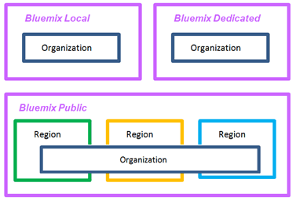
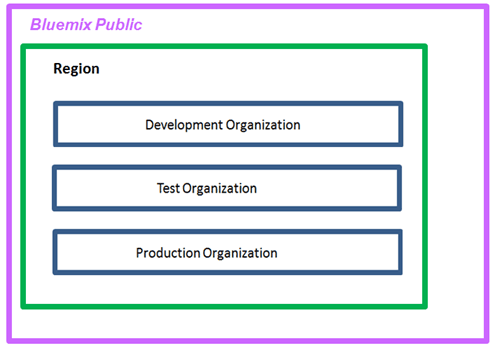
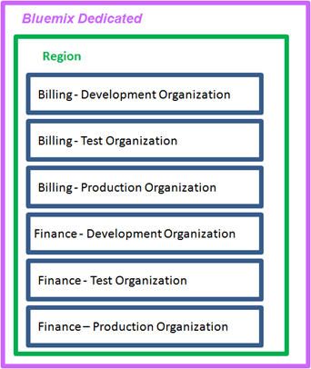

---

copyright:

  years: 2015, 2016
  lastupdated: "2016-06-15"

---

{:new_window: target="_blank"} 
{:shortdesc: .shortdesc} 
{:screen:.screen} 
{:codeblock:.codeblock}

# Designing your cloud environment
{: #patterns}
Last updated: 15 June 2016
{: .last-updated}

When you design a hybrid cloud solution, you must take into consideration security and operational requirements, country regulations, market directives, and corporate policies. {{site.data.keyword.Bluemix_notm}} is an open standards cloud platform for building, running, and managing applications and services that offers three types of cloud environments to help you architect your hybrid cloud environment:
* [{{site.data.keyword.Bluemix_notm}} Public](../public/index.html#public "{{site.data.keyword.Bluemix_notm}} Public") is a cloud environment where infrastructure resources are shared by different companies and users. 
* [{{site.data.keyword.Bluemix_notm}} Dedicated](../dedicated/index.html#dedicated "{{site.data.keyword.Bluemix_notm}} Dedicated") is a  cloud environment in your own dedicated infrastructure that you can connect securely to the {{site.data.keyword.Bluemix_notm}} Public cloud and your own network.
* [{{site.data.keyword.Bluemix_notm}} Local](../local/index.html#local "{{site.data.keyword.Bluemix_notm}} Local") is a cloud behind your company firewall that you can use to protect your most sensitive workloads and connect securely to {{site.data.keyword.Bluemix_notm}} Public and {{site.data.keyword.Bluemix_notm}} Dedicated.

To design a cloud environment that uses {{site.data.keyword.Bluemix_notm}} Public, {{site.data.keyword.Bluemix_notm}} Dedicated, {{site.data.keyword.Bluemix_notm}} Local, or any combination of them, you can use any of the following patterns:
* [Single-organization pattern](#single)
* [Multi-organization pattern](#multi)

If you require the same set of users to access resources that are available anywhere in the organization either in {{site.data.keyword.Bluemix_notm}} Public, {{site.data.keyword.Bluemix_notm}} Dedicated, or {{site.data.keyword.Bluemix_notm}} Local, consider using the single organization pattern.

If you require isolation between different environments within {{site.data.keyword.Bluemix_notm}} Public, {{site.data.keyword.Bluemix_notm}} Dedicated, or {{site.data.keyword.Bluemix_notm}} Local, consider using the multi-organization pattern. 

{:shortdesc}

## Single-organization Pattern
{: #single}

The single-organization pattern is based on the following principles:

1. A cloud architecture where infrastructure resources are shared by different areas of the company.
2. Isolation of applications, projects, or both.
3. Authorization to manage resources granted by role.

When you design a single-organization architecture, you create an account in {{site.data.keyword.Bluemix_notm}} Public, {{site.data.keyword.Bluemix_notm}} Dedicated, or {{site.data.keyword.Bluemix_notm}} Local and define one organization. You can then define multiple spaces that are based on different lines of business (LoB), the delivery phases, specific projects, applications, user's permisisons, or a combination. 

Consider the following information when you design the organizational architecture for your {{site.data.keyword.Bluemix_notm}} Public, {{site.data.keyword.Bluemix_notm}} Dedicated, or {{site.data.keyword.Bluemix_notm}} Local cloud:

1. To define one organization, see [Guidance defining multiple organizations](#singleorg)
2. To define multiple spaces, see [Guidance defining multiple spaces](#singlespace)
3. To grant permissions to users based on Bluemix roles, see [Guidance assigning roles to users](#roles).

## Multi-organization Pattern
{: #multi}

The multi-organization pattern is based on the following principles:

1. A cloud architecture where infrastructure resources are not shared by different areas of the company.
2. Isolation of applications, projects, or both.
3. Authorization to manage resources granted by role.

When you design a multi-organization architecture, you create an account in {{site.data.keyword.Bluemix_notm}} Public, {{site.data.keyword.Bluemix_notm}} Dedicated, or {{site.data.keyword.Bluemix_notm}} Local. Next, you define organizations corresponding to different lines of business (LoB), delivery phases, specific projects, users' permisisons, or a combination of these. You can then define multiple spaces that are based on applications or projects that are delivered by the same department in the company. Consider the following information when you design the organizational architecture for your {{site.data.keyword.Bluemix_notm}} Public, {{site.data.keyword.Bluemix_notm}} Dedicated, or {{site.data.keyword.Bluemix_notm}} Local cloud:

1. To define multiple organizations, see [Guidance defining multiple organizations](#multiorg)
2. To define multiple spaces, see [Guidance defining multiple spaces](#multispace)
3. To grant permissions to users based on Bluemix roles, see [Guidance assigning roles to users](#roles).

## Organizations
{: #org}

{: #singleorg}
When you adopt a single-organization architecture, the organization includes all the cloud resources, services, and applications that you use to develop, manage, and deploy cloud applications. In {{site.data.keyword.Bluemix_notm}} Public, the organization provides isolation between accounts and is available across all regions.

 

 *Figure 3. Example of a single-organization architecture for {{site.data.keyword.Bluemix_notm}} Public, {{site.data.keyword.Bluemix_notm}} Dedicated, and {{site.data.keyword.Bluemix_notm}} Local *

{: #multiorg}
When you adopt a multi-organization architecture, organizations provide the first level of isolation and abstraction that you can use to control and define what can be done and by whom. You design each organization around the different lines of business (LoB), the delievry phases, the IT roles of the users, specific projects, or a combination.  

The number of organizations that you require depends on multiple factors:
*	The level of granularity that you require within your organization to manage quotas and control costs.
*	The level of security that you must enforce in your different environments.
*	The location of the organizations due to corporate, country, and industry requirements. For example, you might want to run all your apps in a dedicated cloud that is located in a region in your geography (GEO).

The following scenarios show different approaches that you can adopt when you define the number of {{site.data.keyword.Bluemix_notm}} organizations in a cloud environment:
* Scenario 1: Isolation of users by delivery phase

  Description: You have different sets of users that need to work in the development environment, the test environment, and the production environment. 
  
  Solution: You can create organizations based on the type of IT work, for example, one organization for development, one for testing, and one for production.

  
 
  *Figure 1. Example of a multi-organization architecture aligned to delivery phases in {{site.data.keyword.Bluemix_notm}} Public *

* Scenario 2: Isolation based on type of users (internal users, external users)
  
  Description: Your company works with different partners. You require different applications for internal users and for external ones.
  
  Solution: You can create organizations to develop, test, and run applications that are used internally. In addition, you can create one or more organizations per partner.

* Scenario 3: Isolation by project
  
  Description: Your company runs hackathons to identify new services.  
  
  Solution: You can define one organization per hackathon and use the organization as a sandbox. After the hackathon, you can promote the sandbox organization into an additional organization in your account.

* Scenario 4: Isolation of users by LoB and delivery phase

  Description: Corporate rules require that development, test, and production users must be different. In addition, the apps of each LoB must be developed, managed, and deployed by different users. Security must be enforced so that users can access only the apps that are relevant to their part of the business. 
  
  Solution: You can create organizations by LoB and then by type of environment, for example, you can create one organization for the development of applications for the billing department, one for testing the billing applications, and one for running the billing applications in production.

  
  
   *Figure 2. Example of a multi-organization architecture aligned with LoB and delivery phases for {{site.data.keyword.Bluemix_notm}} Dedicated *

When you are defining the list of organizations for your cloud organization, consider the following guidance:
* Define and enforce a naming convention. For example, define a naming convention where the organization's name includes information about the business area, the type of cloud ({{site.data.keyword.Bluemix_notm}} Public, {{site.data.keyword.Bluemix_notm}} Local, or {{site.data.keyword.Bluemix_notm}} Dedicated), and the IT role (development, testing, or production). For organizations that are located in {{site.data.keyword.Bluemix_notm}} Public, you might want to add information about the region too. 
* Define the restrictions that apply to the organization. For example, define the role of the users that are going to work in that organization. 
* Identify the manager of the organization.
* Identify the area of the business that is allocated to this organization.

## Spaces
{: #spaces}

Within an organization, spaces provide an additional level of isolation and abstraction. 

A space is a reserved area in the organization where users can develop and run applications and services. You can create any number of spaces in an organization. You can control the users that have access to a space. For more information about managing spaces, see [Spaces](../admin/orgs_spaces.html#spaceinfo "Spaces").

{: #singlespace}
When you adopt a single-organization architecture, the level of isolation and abstraction is provided by the spaces that you define within the organization. Consider the following guidance when you define spaces:
* Define a space to host a service that requires provisioning and configuring only once in the organization. 
* Define spaces based on the delivery lifecycle. 
  For example, you can define one or more spaces for applications that are being developed, one or more spaces for applications that are in the test phase, and one or more spaces for applications that are in production.
* If the isolation by delivery lifecycle is not sufficient, you can achieve more isolation by defining one or more spaces per LoB and delivery phase.
* If you require isolation by sets of users, define a space for each set of users. 
  For example, your developers cannot test the application and test it. You require a different set of users to test it. In this scenario, you create two spaces, one for developers of the application and one for testers of the application. Then grant each set of users access to the correct space.

{: #multispace}
When you adopt a multi-organization architecture, you can isolate each organization by phase of the delivery lifecycle, by line of business, or both. You can then define multiple spaces that are based on the number of applications or projects that are delivered by the same department in the company. Consider the following guidance when you plan the spaces in an organization:

* Define a space per application, per group of related applications, or for a specific project. 
* If you require isolation by sets of users, define a space for each set of users.
  

When you are defining the list of spaces for your cloud organization, consider the following guidance:
* Define and enforce a naming convention. For example, define a naming convention where the space name includes information about where the organization is located and the type of cloud ({{site.data.keyword.Bluemix_notm}} Public, {{site.data.keyword.Bluemix_notm}} Local, or {{site.data.keyword.Bluemix_notm}} Dedicated).
* Define the restrictions that apply to the space. For example, define the type of applications that can be developed, managed, and deployed in each space. 
* Identify the manager of the space.

## Quota
{: #quota}

When you create an organization in {{site.data.keyword.Bluemix_notm}}, you provision infrastructure resources that include resources such as memory, IP, CPU, and storage:
*	For {{site.data.keyword.Bluemix_notm}} Public, a minimum set of resources is allocated to an organization. Based on the type of account, you have different resource allocations. These resources define the quota that is allocated to an organization. 
*	For {{site.data.keyword.Bluemix_notm}} Dedicated, you request a set of resources from IBM, and then you can distribute them between the different organizations in your {{site.data.keyword.Bluemix_notm}} Dedicated cloud environment. 
*	For {{site.data.keyword.Bluemix_notm}} Local, you provide the resources and then you can distribute them between organizations in your {{site.data.keyword.Bluemix_notm}} Local cloud environment.

For {{site.data.keyword.Bluemix_notm}} Public and {{site.data.keyword.Bluemix_notm}} Dedicated, you can request additional resources from IBM. For {{site.data.keyword.Bluemix_notm}} Local, you are responsible for providing any resources that might be required to run your business in the local cloud.

The quota that is allocated to an organization represents the resources that are available within the organization. You manage the quota and you decide how to distribute the resources in the organization.

You monitor and manage the quota of an account by space and by compute infrastructure. Any resource that is provisioned in a space of the organization contributes to the usage of the organization's quota. 
* For more information about how to view and manage the quota of an organization in {{site.data.keyword.Bluemix_notm}} Public, see [Managing quota](../admin/orgs_spaces.html#managequota "Managing quota"). 
* For more information about how to view and manage the quota of an organization in {{site.data.keyword.Bluemix_notm}} Dedicated or {{site.data.keyword.Bluemix_notm}} local, see [Viewing usage and reports](../admin/index.html?pos=2#oc_resource "Viewing usage and reports").

In a multi-organization architecture, you define the number of organizations based on the different lines of business (LoB), the delivery phases, specific projects, user's permisisons, or a combination. For example, when you define the level of granularity of an organization at the LoB and delivery phase, and the number of spaces by project, you can identify the resources that are used for development, test, and production for projects that are the responsibility of a LoB. You can also monitor the resources that are allocated to each project by viewing the space quota. In a single-organization architecture, to obtain the same level of detail, the criteria for defining spaces should consider isolation by LoB, delivery phase, and project. The naming convention for each space should facilitate the identification of the project including information about the LoB, the phase in the delivery lifecycle, and the project. 

Whether you adopt a multi-organization architecture or a single-organization architecture, use a naming convention for spaces that easily identifies and shows the quota allocation that you require.   

## Users and roles
{: #roles}

You can grant multiple roles to users in a {{site.data.keyword.Bluemix_notm}} account. These roles define the permissions of the user to manage account and organization resources:
* You can grant [user roles](../admin/users_roles.html#userrolesinfo "user roles" ) to members of an organization. These roles define the level of access within the organization, and who can access a space and its resources. For example, you can grant users different permissions to different spaces.
* In {{site.data.keyword.Bluemix_notm}} Dedicated and {{site.data.keyword.Bluemix_notm}} Local only, you can grant [administrative roles](../admin/index.html#oc_useradmin "administrative roles" ) to members of an account to manage system information, usage of account resources, reports and logs, catalog services, users, and resource usage per organization.

Whether you design a multi-organization architecture or a single-organization architecture, the account owner is the super user of the cloud environment.

The account owner core tasks include:
* Managing the resources of the global account.
* Creating organizations.
* Adding users as team members to the account. 

To add users to an account, use the email address of the user or a list of email addresses. In {{site.data.keyword.Bluemix_notm}} Dedicated and {{site.data.keyword.Bluemix_notm}} Local, you can also use the company’s LDAP to add users, groups of users, or both, or import users from a file. For more information, see [Managing users and permissions](../admin/index.html#oc_useradmin "Managing users and permissions").

Other tasks of the account owner include:
* Adding 1 or more users as managers of an organization by assigning these users the **Manager** role. Consider adding a minimum of 2 users as managers of the organization. The first user acts as the principal manager of the organization. The second user acts as the deputy manager, in case, the principal manager is not available. 
* In {{site.data.keyword.Bluemix_notm}} Public, and depending on the [account type](../pricing/index.html#pay-accounts "account type"), setting spending notifications. First, the account owner defines the thresholds that are used to alert him when costs reach a certain limit. Then, [configures email notifications](../admin/account.html#notifications "configures email notifications"). The account manager can use the information in the emails as alert notifications and might take action based on the information provided, for example upgrading the account. **Note:** The account owner is the only person that can receive spending notification emails. 
* In {{site.data.keyword.Bluemix_notm}} Dedicated or {{site.data.keyword.Bluemix_notm}} Local, 
  * Adding 1 or more users as administrators of the account by assigning these users the **Admin** role. Consider adding a minimum of 2 users. The first user acts as the principal administrator of the account. The second user acts as the deputy administrator.
  * Defining account notifications to inform about maintenance updates or critical incident alerts. These notifications can be configured to send an email or an SMS.

### User roles 

User roles define the permissions that you can assign to a user in an organization and define the level of access that a user has within the organization and each space. 

In a multi-organization architecture or in a single-organization architecture, define the users and the permissions that each user requires to do their work:
1. Identify the set of users that require access to an organization.
2. Define the permissions for each user in the organization and in a space of the organization.
3. Select the role that grants a user the permissions required.
   * [Manager role for an organization](#manager)
   * Auditor role for an organization](#orgauditor)
   * [Billing role for an organization](#orgbilling)
   * [Manager for a space](#spmanager)
   * [Developer for a space](#dev)
   * [Auditor for a space](#spauditor)

{: #manager}
The principal manager of the organization is responsible for creating spaces, distributing the quota between spaces, inviting users and optionally granting them roles, and defining custom domains. The following list outlines the tasks of a manager of an organization:
1. Create the spaces that have been identified. Consider adopting and enforcing a naming convention. 
2. Distribute the quota between the spaces based on the type of applications that will be running in each space.
3. Invite users to the organization. 
4. Grant the **Space Manager** role to at least one user per space.
5. Grant the **Organization Billing** role to a set of users.
6. Grant the **Organization Auditor** role and the **Space Auditor** role to a set of users. 
7. Define domains.

{: #orgauditor}
The users that are granted the **Organization Auditor** role can monitor the quota and the users for all the spaces in an organization. 
* When you adopt a multi-organization architecture, consider granting the same set of users the auditor role in each organization that is part of the account. These users can then monitor the quota across all organizations in your cloud environment and obtain a global view of the account. 
* When you adopt a single-organization architecture, identify the users that are responsible for monitoring the quota usage.

{: #orgbilling}
The users that are granted the **Organization Billing** role can monitor the costs of an organization. 
* When you adopt a multi-organization architecture, consider granting the same set of users the billing role in each organization that is part of the account. These users can then monitor each organizations' spending costs and obtain a global view for the account. 
* In a single-organization architecture, identify the users that are responsible for monitoring the cost.

{: #spmanager}
The space manager is responsible for any work that is done within the space that he manages and controls. The space manager 
* Monitors the quota that has been allocated to the space. 
* Requests additional resources to the organization manager.
* Notifies the organization manager of resources that are not required. 
* Adds users to the space with the **Developer** role.
* Optionally, assigns the **Space Manager" role to a user so this user can act as deputy space manager in his absence.

{: #dev}
In {{site.data.keyword.Bluemix_notm}} Public, the developers are users that are granted access to a space and have been assigned the **developers** role. These users can do any of the following tasks within the space:
* Manage CF applications.
* Provision and configure {{site.data.keyword.Bluemix_notm}} services 
* Associate domains to applications.

In {{site.data.keyword.Bluemix_notm}} Dedicated and {{site.data.keyword.Bluemix_notm}} Local, the developers are also users that are granted access to a space and are assigned the **developers** role. These users can do any of the following tasks within the space:
* Manage CF applications.
* Provision and configure {{site.data.keyword.Bluemix_notm}} services 
* Associate domains to applications.

{: #spauditor}
Consider granting the **audit** role in each space to the same users that you granted the  **Organization Auditor** role. You may also  have requirements to grant this role to a specific set of users.

### Administrative roles 

[Administrative roles](../admin/index.html#oc_useradmin "Administrative roles" ) define the permissions that you can grant users to manage a {{site.data.keyword.Bluemix_notm}} Dedicated or a {{site.data.keyword.Bluemix_notm}} Local account. You can grant read or write permissions to allow a user to view system information, usage of the account resources, reports and logs, catalog services, users, and resource usage per organization. 

In a multi-organization architecture or in a single-organization architecture, define the users and the permissions that each user requires to manage the account:

1. Identify the set of users to whom you plan to grant administration permissions and will be part of the administration cloud team. Include the managers of organizations as members of this team.
2. Define the permissions for these users in the account. Divide permissions to manage the catalog and reports between users of the team.
3. Select one or more roles for each user to match the permissions required to manage the account:
   * Admin role: Grant this role to 2 more users in the account. Users with this role have permissions to manage the entire organization.
   * User role: This role can be configured with read or write permissions. Grant this role with write permissions to managers of organizations to allow them to add users to the account and their organizations. Grant this role with read permissions to managers of organizations that might need access to see the list of members in the account.
   * Catalog role: This role can be configured with read or write permissions. Grant this role to a set of users with write permissions to allow them to define and manage which Bluemix services and starters are visible to users in the Bluemix Catalog. Grant this role with read permissions to managers of organizations.
   * Reports role: This role can be configured with read or write permissions. Grant this role to a set of users with write permissions to allow them to view and add reports that other users with read permissions can download. Grant read permissions to all members of the admin team.
   * Login role: Grant this role to all members of the admin team. You can also grant this role to other users in the account that require access to view the account notifications and system information.

