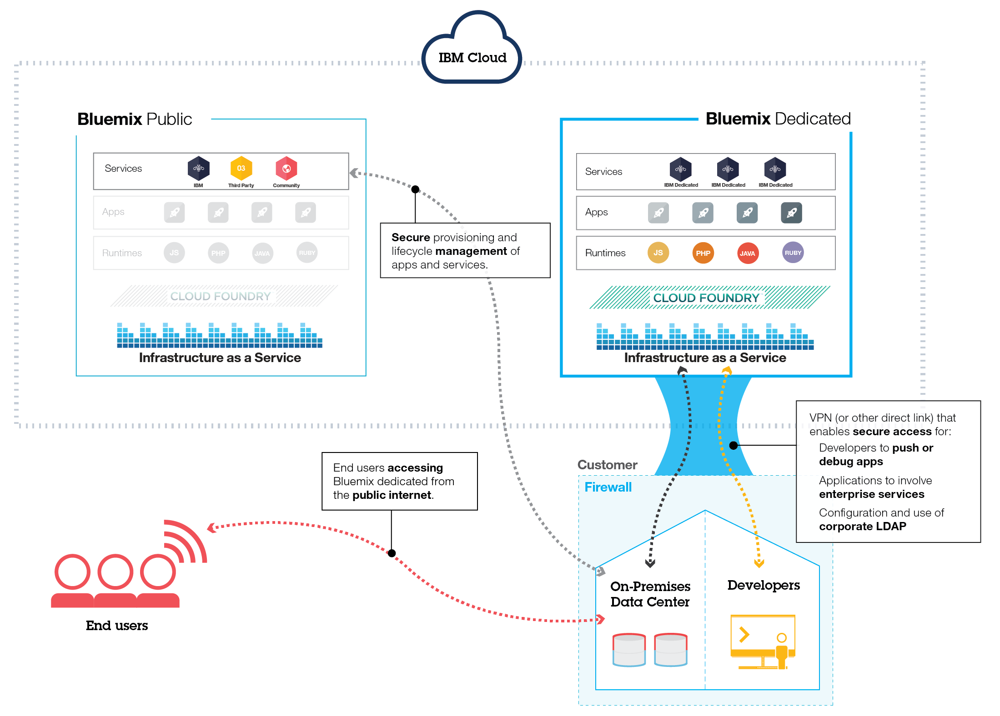

---

copyright:

  years: 2015, 2016
lastupdated: "2016-11-21"

---

{:new_window: target="_blank"}
{:shortdesc: .shortdesc}

# {{site.data.keyword.Bluemix_notm}} Dedicated
{: #dedicated}

{{site.data.keyword.Bluemix_notm}} operated by 21ViaNet is an open-standards, cloud-based platform for building, running, and managing applications. With {{site.data.keyword.Bluemix_notm}} Dedicated, you get the power and simplicity of {{site.data.keyword.Bluemix_notm}}&mdash;in your own dedicated environment that is securely connected to both the {{site.data.keyword.Bluemix_notm}} Public environment and your own network.
{:shortdesc}

{{site.data.keyword.Bluemix_notm}} Dedicated in China is supported by IBM Bluebox, an OpenStack-based, private cloud infrastructure. {{site.data.keyword.Bluemix_notm}} Dedicated customers in China can request support from the [{{site.data.keyword.Bluemix_notm}} Supporting Ticket System](https://chinabluemix.itsm.unisysedge.cn){: new_window}. In addition, Chinese customers can get free support from [IBM developerWorks China Developer Centers](https://developer.ibm.com/cn_answers/bluemix/){: new_window}.

All dedicated deployments of {{site.data.keyword.Bluemix_notm}} include the following benefits and features at no additional cost: VPN, private virtual local area network (VLAN), firewall, connectivity with your LDAP, ability to leverage existing on-premises databases and apps, 24/7 on-site security, dedicated hardware, and standard support.

{{site.data.keyword.Bluemix_notm}} Dedicated comes with all included {{site.data.keyword.Bluemix_notm}} runtimes and 64 GB of compute resources memory.

In addition, a set of services used as {{site.data.keyword.Bluemix_notm}} Dedicated services will be gradually launched by the end of 2017. Review the following table to see what is included and what you can purchase optionally.

*Table 1. Dedicated Services*

| **Type**        | **Name**            | **Description** |      
|-----------------|-------------------|-------------------|
|Included | [{{site.data.keyword.Bluemix_notm}} runtimes](/docs/cfapps/runtimes.html) | Use runtimes to get your app up and running quickly, with no need to set up and manage machines and operating systems. All {{site.data.keyword.Bluemix_notm}} runtimes are available for you to use in your {{site.data.keyword.Bluemix_notm}} Dedicated instance.|
| Included | [{{site.data.keyword.autoscaling}}](/docs/services/Auto-Scaling/index.html) | Dynamically increase or decrease the compute capacity of your application based on policies. With this service, you have unlimited use in your {{site.data.keyword.Bluemix_notm}} Dedicated environment. |
|Optional | [{{site.data.keyword.cloudant}}](/docs/services/Cloudant/index.html#Cloudant) | {{site.data.keyword.cloudant}} provides access to a fully managed NoSQL JSON data layer that's always on. This service is compatible with CouchDB, and accessible through a simple to use HTTP interface for mobile and web application models. |
| Optional | [{{site.data.keyword.dashdbshort}}](/docs/services/dashDB/dashDB.html) | Use dashDB to store relational data, including special types such as geospatial data. Then analyze that data with SQL or advanced built-in analytics like predictive analytics and data mining, analytics with R, and geospatial analytics. |
| Optional | [{{site.data.keyword.messagehub}}](/docs/services/MessageHub/index.html#messagehub) | {{site.data.keyword.messagehub}} is a scalable, distributed, high throughput message bus to unite your on-premises and off-premises technologies. {{site.data.keyword.messagehub}} is based on Apache Kafka, which is a fast, scalable, and durable real-time messaging engine. |
| Optional | [{{site.data.keyword.iot_short}}](/docs/services/IoT/index.html) | This service lets your apps communicate with and consume data collected by your connected devices, sensors and gateways. The base offering permits running a private version of the {{site.data.keyword.iot_short}} within the dedicated environment with a capacity of 100,000 concurrently connected devices or applications and 1.6 TB of data exchange. |

There are optional components that are available for you to purchase to scale and extend the capacity of your resources and services. You can purchase any of these components by contacting the sales team.

## {{site.data.keyword.Bluemix_notm}} Dedicated architecture
{: #dedicatedarch}

Based on BlueBox, {{site.data.keyword.Bluemix_notm}} Dedicated ensures that you have the highest performing cloud infrastructure available to you. Each data center has 24 hour, 7 days a week security, and rigorous controls. You and 21Vianet access your {{site.data.keyword.Bluemix_notm}} dedicated instance through a VPN tunnel and a private VLAN.

{{site.data.keyword.Bluemix_notm}} Dedicated sits on your network through a VPN or a direct network connection. Your single-tenant hardware can be set up in 21Vianet's ultimate data center that is located in Beijing. 21Vianet manages the dedicated platform and dedicated services, so you can focus on building custom apps. In addition, 21Vianet performs all maintenance to dedicated instances during a maintenance window selected by you.

*Figure 1. Detailed {{site.data.keyword.Bluemix_notm}} Dedicated diagram*

{{site.data.keyword.Bluemix_notm}} Dedicated environments have the same security standards as the public {{site.data.keyword.Bluemix_notm}} in terms of infrastructure, operational, and physical security. However, developer access to the dedicated {{site.data.keyword.Bluemix_notm}} is controlled by your LDAP policies, which can be configured by the {{site.data.keyword.Bluemix_notm}} team when they set up your environment. Within the dedicated environment, you can manage user roles and permissions. See [Managing users and permissions](/docs/admin/index.html#oc_useradmin) for details.

##Setting up {{site.data.keyword.Bluemix_notm}} Dedicated
{: #setupdedicated}

{{site.data.keyword.Bluemix_notm}} Dedicated is designed to provide a private version of the {{site.data.keyword.Bluemix_notm}} Public offering. You can use {{site.data.keyword.Bluemix_notm}} services and runtimes to support your computing needs in an 21Vianet-hosted account.

21Vianet provides you access to {{site.data.keyword.Bluemix_notm}} Dedicated by using a password-secured login. You can access the services, runtimes, and associated resources, and deploy and remove {{site.data.keyword.Bluemix_notm}} apps. 

To set up your private version of {{site.data.keyword.Bluemix_notm}}(may incur costs):

<ol>
<li>Contact your designated account representative from 21Vianet or <a href="https://console.chinabluemix.net/?direct=classic/#/contactUs/cloudOEPaneId=contactUs" target="_blank">contact {{site.data.keyword.Bluemix_notm}}</a> to get started.</li>
<li>Work with 21Vianet on your fee for your {{site.data.keyword.Bluemix_notm}} Dedicated instance. The monthly recurring fee is based on the dedicated services that you want to use, plus a subscription to all {{site.data.keyword.Bluemix_notm}} public services. You then receive an invoice for anything that you use beyond that subscription agreement.</li>
<li>Identify the deadlines for each phase of setting up your {{site.data.keyword.Bluemix_notm}} Dedicated instance. For information about each phase and the tasks involved, see <a href="index.html#rolesresponsibilities" target="_blank">{{site.data.keyword.Bluemix_notm}} Dedicated roles and responsibilities</a>.</li>
<li>Then, your dedicated platform and account are created. For your account, you identify the people in your organization for the roles that are needed to get your dedicated instance up and running. For information about the roles that you assign, see <a href="index.html#rolesresponsibilities" target="_blank">{{site.data.keyword.Bluemix_notm}} Dedicated roles and responsibilities</a>.
</li>
<li>Define and establish network connectivity between your corporate network and your {{site.data.keyword.Bluemix_notm}} Dedicated instance.
	<ol type="a">
	<li>21Vianet installs monitoring and security infrastructure for the dedicated instance.</li>
	<li>21Vianet installs the single-tenant dedicated services that you selected.</li>
	<li>You provide network configuration and endpoints for things such as IP addresses or firewalls and access to your LDAP for integration into {{site.data.keyword.Bluemix_notm}}.</li>
	</ol>
</li>
<li>Identify and assign roles for your administrative team for the environment.
	<ol type="a">
	<li>21Vianet configures network access and LDAP based on what you provided. Administrative access is given to the contacts that you designate. You must also designate a contact for support and billing.</li>
	<li>21Vianet sets up a syndicated catalog in your dedicated environment to show your dedicated services. The syndicated catalog includes additional services that are syndicated from and available for you to use from {{site.data.keyword.Bluemix_notm}} Public. You have the option to decide which public services meet the requirements for your business based on your data privacy and security criteria.</li>
	<li>You validate network and firewall configuration and the LDAP endpoint and access.</li>
	</ol>
</li>
</ol>

You can expect a process similar to the following list for the initial deployment and configuration for your environment. For details about who is responsible for each task, see [Roles and responsibilities](index.html#rolesresponsibilities).

<ol>
<li>You specify the domain names for the deployment, and the IDs that you want to use. You get three domains when you set up your {{site.data.keyword.Bluemix_notm}} instance. You pick the prefix for the <code>*mycompany*.chinabluemix.net</code> and <code>*mycompany*.mychinabluemix.net</code>. And, you choose the full name for the third domain. 

You can choose as many custom domains as you want. However, you are responsible for the certificates for the custom domains. For information about creating your custom domain, see <a href="/docs/manageapps/updapps.html#domain">Creating and using a custom domain</a>.
</li>
<li>You identify an owner for the public account that is used to represent your company in {{site.data.keyword.Bluemix_notm}} Public. 21Vianet uses this account for tracking syndicated services usage.</li>
<li>You decide whether there will be any access to your dedicated environment from the public Internet.</li>
<li>You select the type of authentication that will be used. The optional types include 21ViaNet or Active Directory.</li>
<li>You identify and assign roles for your administrative team for the environment. For information about the roles that you must assign, see <a href="index.html#rolesresponsibilities" target="_blank">{{site.data.keyword.Bluemix_notm}} Dedicated roles and responsibilities</a>.</li>
<li>21Vianet deploys the core platform that includes the elastic runtimes, console, administration feature, and monitoring.</li>
<li>21Vianet configures your administrative access to the environment.</li>
<li>You can start using your dedicated instance that is monitored by the 21Vianet operations team in order to respond to alerts.</li>
</ol>

After your {{site.data.keyword.Bluemix_notm}} instance is set up, you can monitor and manage your {{site.data.keyword.Bluemix_notm}} instance by using the Administration page. 

##Roles and responsibilities
{: #rolesresponsibilities}

If you set up a {{site.data.keyword.Bluemix_notm}} Dedicated account, you identify the people in your organization for the roles that are needed to get your instance up and running.

###Roles

The following list shows the customer roles and responsibilities that you assign:

<dl>
<dt>**Procurement focal**</dt>
<dd>Works with the 21Vianet representative on establishing your {{site.data.keyword.Bluemix_notm}} Dedicated environment, including identifying the right people in your organization to work on any aspect of the project. The person assigned to this role takes on a project management role and oversees pattern selection, commercial arrangements, and arrangement of access to customer resources. The procurement focal is the overall contact for setting up the dedicated instance and tracking the process of the deployment.</dd>
<dt>**Compliance officer**</dt>
<dd>Works with the 21Vianet representative to select a topology and deployment option that meets your security requirements. The person assigned to this role works with the 21Vianet compliance consultant to determine which deployment patterns achieve the compliance goals.</dd>
<dt>**Network specialist**</dt>
<dd>Works with the 21Vianet representative on the network plans for the {{site.data.keyword.Bluemix_notm}} deployment. The person assigned to this role reviews the required networking specifications required by 21Vianet and works together with 21Vianet on an implementation plan. At the end of the installation and verification phase, the person assigned to this role approves that the network configuration is in compliance with corporate standards.</dd>
<dt>**DevOps focal**</dt>
<dd>Works with the 21Vianet representative to plan and apply the maintenance updates that are needed for the {{site.data.keyword.Bluemix_notm}} platform, services, and runtimes. The person assigned to this role also works with the 21Vianet representative on the configuration of your {{site.data.keyword.Bluemix_notm}} Dedicated instance.</dd>
</dl>

Your customer representatives work with 21Vianet {{site.data.keyword.Bluemix_notm}} specialists that work together to ensure that you always have the support that you need. 

The {{site.data.keyword.Bluemix_notm}} support and operations team that works with you on your {{site.data.keyword.Bluemix_notm}} instance might access your local environment, but does so only for the following reasons.

<ul>
<li>To respond to alerts and perform operational maintenance</li>
<li>To attempt to reproduce a problem that is reported on a support ticket</li>
</ul>

###Responsibilities

From setting up your environment to continued maintenance, a variety of tasks must be completed. The following table outlines the required tasks and the owner for completing the task throughout the inception, progression, and completion phases.

The inception phase is used to establish the {{site.data.keyword.Bluemix_notm}} Dedicated environment. The primary goals of this phase include the following:

- Review the financial agreement, and establish the milestone dates for delivery.
- Create the {{site.data.keyword.Bluemix_notm}} platform, and provide access to runtimes and services.
- Define and establish network connectivity between your corporate network and {{site.data.keyword.Bluemix_notm}} operations.
- Identify and assign roles for your administrative team.

*Table 4. Inception phase tasks*

| **Task** | **Task details** | **Responsible party** |
|----------|------------------|-----------------------|
|Set compliance standards | Identify government, industry, and proprietary corporate standards that are required for the environment. | Customer |
|Create security and compliance integration plan | Create security and integration plan that includes costs, scheduling, and resources that are required to achieve security compliance. | 21Vianet |
|Compliance plan approval | Approve the compliance plan. | Customer |
|Create sizing for environment |  	Create environment sizing based on predefined choices that take into consideration the high availability and disaster recovery goals, as well as initial DEA and service provisioning that is necessary to support the apps created with the platform. You and 21Vianet work together to define, for example, what databases are needed, what services are offered in the customer's syndicated catalog, and more. | 21Vianet and customer share responsibility |
|Select architecture | Select architecture based on predefined choices that take into account high availability and disaster recovery requirements. | 21Vianet |
|Define disaster recovery goals | Define the disaster recovery requirements for the environment. | Customer |
|Create disaster recovery plan | Consult and define the disaster recovery plan. 21Vianet creates a disaster recovery model, and consults with you where you provide feedback and approve the plan. | 21Vianet and customer share responsibility |
|Create backup and recovery plan | Create a backup and recovery plan that defines the frequency and the requirements for on-and-off site distribution of the backup. 21ViaNet backs up fabric components, 21Vianet services, service metadata including user roles, and more. You back up any application-specific data that you are responsible for. | 21Vianet and customer share responsibility |
|Identify tools for event detection and problem determination | Identify 21Vianet and third-party tools used for event detection and problem determination at the {{site.data.keyword.Bluemix_notm}} platform level. | 21Vianet |
|Define escalation plan | Define the escalation plan to triage and resolve events detected from the monitoring components. | 21Vianet |
|Sign infrastructure, platform, and support agreements | Sign the subscription agreement including the financial terms and conditions for the environment. Sign support subscription. | Customer |
|Procure environment | Procure compute resources, network, and storage including core and Services VLAN to host {{site.data.keyword.Bluemix_notm}}, bare metal services to host Data Power, and {{site.data.keyword.Bluemix_notm}} Firewall. Provide infrastructure to allow for VPN tunnel. | 21Vianet |
|Install platform, application, and monitoring and management components | Install, configure, and verify platform components, such as BOSH Director, Cloud Controller, Health Manager, messaging, routers, DEAs and Service providers, and the monitoring components that are defined in the escalation and problem detection plan. | 21Vianet |
|Install and configure security components | Install and configure security components that are tied into the monitoring and escalation plan including IBM QRadar, credential vault, intrusion prevention system, IBM BigFix, and IBM Security Privileged Identity Management. | 21Vianet |
|Install and configure custom components |  	Install and configure custom components that reside outside the scope of the {{site.data.keyword.Bluemix_notm}} product and services. | Customer |
|Establish initial network configuration | Establish initial network configuration including firewalls, DataPower, Fortigate, and DNS. | 21Vianet |
|Connect {{site.data.keyword.Bluemix_notm}} pipeline | Connect {{site.data.keyword.Bluemix_notm}} continuous integration and continuous delivery pipeline with 21Vianet repositories. | 21Vianet |
|Customize external solution components | Customize load balancers for disaster recovery scenarios. | Customer |
|Install VPN solution | Install bidirectional VPN solution. | 21Vianet |
|Configure login server | Configure the login server for use with the corporate LDAP. | 21Vianet |
|Track status for security, compliance, and audit controls  | Track status up to the point where all tools and processes are in place to achieve identified compliance. | Customer |
|Review physical infrastructure | Review physical premises that host the solution components for threats and review of security controls to protect the data center. | Customer |
|Inspect monitoring software | Inspect monitoring and management components as defined in the escalation and problem determination plan. | Customer |
|Inspect OS | Inspect to ensure that the operating system image meets compliance standards. 21Vianet provides access to the OS image. | 21Vianet and customer share responsibility |

Next is the progression phase. The progression phase describes the on-going, collaborative relationship between you and 21Vianet Cloud. The primary goals for this phase include the following:

- Review capacity and coordinate necessary adjustments.
- Review maintenance and platform improvements.
- Coordinate the activities for problem resolution and root cause analysis.

*Table 5. Progression phase tasks*

| **Task** | **Task details** | **Responsible party** |
|----------|------------------|-----------------------|
|Review weekly capacity reports | Review the weekly capacity reports and take corrective action, if needed. | Customer |
|Create month-to-month projections | Collect information and create a month-to-month projection of capacity and consumption. | 21Vianet and customer share responsibility |
|Review capacity projections | Review the capacity projections as they relate to external events that might impact capacity as well as anticipated new deployments of apps. Work with 21Vianet to review the projections and plan accordingly. | 21Vianet and customer share responsibility |
|Review projections | Review the capacity projections as it relates to external events that might impact capacity. | Customer |
|Adjust capacity |  Add or remove capacity as your needs change. | 21Vianet |
|Publish upcoming updates and maintenance | Create documentation for the required maintenance of 21Vianet components. | 21Vianet |
|Perform maintenance | Work with 21Vianet to schedule required maintenance within a 21-day window. You can provide dates that might not work for you in the 21-day window, and 21Vianet works to schedule the maintenance accordingly. | 21Vianet and customer share responsibility |
|Address provisioning failures | Fix provisioning failures, if they occur, for customer-created services that are deployed to the Catalog. | 21Vianet |
|Perform network and IP scans | Perform daily and monthly network and IP scans. | 21Vianet and customer share responsibility |
|Provide access to audit logs | Provide access to all security and administrative audit logs.   | 21Vianet and customer share responsibility |
|Conduct testing | Conduct periodic Key Controls over Operations testing and third-party penetration testing. | 21Vianet and customer share responsibility |
|Status reporting, audit coordination, and compliance meetings  | Complete status reporting, external audit coordination, and representation at compliance review status meetings. | 21Vianet |
|Employment and business need verification | Complete quarterly employment verification and verification of continued business need for 21Vianet representatives that have access to the customer environment. | 21Vianet |
|Resolution of security vulnerabilities | Resolve reported security vulnerabilities in the platform. | 21Vianet |

The final stage of completion represents the end of the relationship between you and {{site.data.keyword.Bluemix_notm}}. The primary tasks for this phase include the following:

* Ending of the financial agreement
* Removing all network connections
* Recycling infrastructure

*Table 6. Completion phase tasks*

| **Task** | **Task details** | **Responsible party** |
|----------|------------------|-----------------------|
|End financial agreement | Discuss and agree to an end to the financial agreement contract. | 21Vianet and customer share responsibility |
|Decommission environment | Shut down access to and credentials for the environment. | 21Vianet and customer share responsibility |
|Remove customer network connections | Remove network connections between 21Vianet and the customer environment. | 21Vianet and customer share responsibility |
|Recycle infrastructure | Your environment is recycled based on the {{site.data.keyword.Bluemix_notm}}-defined processes. | 21Vianet |

<!-- Disabled on 10/11/2016 per Bingbing's request

##Maintaining your dedicated instance
{: #maintaindedicated}

21Vianet maintains and installs updates and fixes as 21Vianet deems appropriate to the {{site.data.keyword.Bluemix_notm}} runtimes and services. Services might not be available during maintenance windows. In addition, 21Vianet works with you to schedule maintenance updates for the {{site.data.keyword.Bluemix_notm}} platform.

The following types of maintenance are required for {{site.data.keyword.Bluemix_notm}} Dedicated:
<dl>
<dt>**Standard maintenance for services**</dt>
<dd>The services utilize pre-defined, standard maintenance windows, which might cause the services to be unavailable. 21Vianet does not require customer approval to perform service maintenance, but attempts to minimize impact to your services. 
 
21Vianet sends notification of the changes that are planned for each maintenance window on the Status page. 
 
**Important**: Some services might not be available to you during the maintenance period.</dd>

<dt>**Standard maintenance for the {{site.data.keyword.Bluemix_notm}} platform**</dt>
<dd>Maintenance updates are applied based on coordination between you and 21Vianet within a 21-day window. You provide 21Vianet with preapproved maintenance windows and specific dates or times that might not work for you, and 21Vianet works to schedule updates during or around the dates that you selected.

Go to **ADMINISTRATION > SYSTEM INFORMATION** to view scheduled and pending maintenance updates. For more information about setting your preapproved windows, unavailable dates, and viewing or approving scheduled maintenance updates, see <a href="/docs/admin/index.html#oc_schedulemaintenance">Maintenance updates</a>
.</dd>
</dl>

**Important**: 21Vianet reserves the right to interrupt services to apply emergency maintenance as needed. 21Vianet might change scheduled maintenance hours, but will notify you of any such changes, as well as any emergency maintenance information.

If there is a reported issue following a maintenance update, you agree with {{site.data.keyword.Bluemix_notm}} Support if it is in your best interest to allow 21Vianet to roll back the update. Upon agreement, 21Vianet rolls back the update to restore the environment to the previous state.

Disabled part ends here, 10/11/2016-->

## Incident response and support
{: #incidentresponse}

### Customer-detected issues

If you identify an issue that needs attention from 21Vianet support and operations, you can contact support by using [{{site.data.keyword.Bluemix_notm}} Supporting Ticket System](https://chinabluemix.itsm.unisysedge.cn){: new_window}. Depending on the issue, you, 21Vianet, or both work together to fix the issue.

### 21Vianet-detected critical incidents

Critical incidents are urgent, unexpected service outages, and stability issues that affect your environment or your users. If 21Vianet detects a critical incident within your environment, you are notified by a notification on the **Status** page. You can also check the Status page for any known issues for the platform or your services. For more information about the Status page, see [Viewing status](/docs/admin/index.html#oc_status).

*Figure 2. Incident response process*

Depending on the issue, you, 21Vianet, or both of you work together to fix the issue. If you have a question regarding the incident, or if you need an 21Vianet representative to help you resolve the issue, then you can open a support ticket. 

## Disaster recovery
{: #dr}

Disaster recovery for {{site.data.keyword.Bluemix_short}} Dedicated can be set up similarly to the way that it works when you use {{site.data.keyword.Bluemix_short}} Public. {{site.data.keyword.Bluemix_short}} Public provides a continuously available platform for innovation with multiple fail-safe measures to ensure that your orgs, spaces, and apps are always available. Deploying apps to multiple geographic regions enables continuous availability that protects against unplanned, simultaneous loss of multiple hardware or software components, or the loss of an entire data center, so that even in the event of a natural disaster in one geographic location, your distributed {{site.data.keyword.Bluemix_notm}} Public app instances in alternate geographic locations will be available.
{: shortdesc}

Disaster recovery for {{site.data.keyword.Bluemix_short}} Dedicated is made possible through continuous availability for your apps, the inherent high availability of the platform, and the ability to restore your instance in the event of a failure. You are responsible for enabling continuous availability of your apps by deploying to multiple regions. High availability is built in at the platform level through  technologies included in Cloud Foundry and other components. And, you can work together with 21Vianet to ensure your data is properly backed up in the case that you need to restore your instance at any time.

### High availability
{: #ha}

{{site.data.keyword.Bluemix_notm}} provides high availability across the platform by using technologies built into Cloud Foundry and other components.

These technologies include the following:

<dl>
<dt>DEA Scalability in Cloud Foundry</dt>
<dd>A Cloud Foundry <a href="https://docs.cloudfoundry.org/concepts/architecture/execution-agent.html" target="_blank">Droplet Execution Agent (DEA)</a> performs health checks on the apps running within it. If there is a problem with the app or the DEA itself, it deploys additional instances of the app to an alternate DEA to address the issue. For more information, see <a href="https://docs.cloudfoundry.org/concepts/high-availability.html" target="_blank">Configuring CF for High Availability with Redundancy</a>.

To ensure high availability for your applications, you need enough compute resources to balance the load, and you might also require additional compute resources to support a possible failure. If you need to scale your environment by increasing your DEA pool to be prepared for a failure or address a spike in the load for your app instances, you can work with your 21Vianet representative to order additional DEAs and ensure that you have the appropriate hardware to support the added resources.

</dd>
<dt>Bluebox Redundancy</dt>
<dd>When you use Bluebox in a dedicated environment, the data in each cloud storage cluster is written for multiple times, and all the storage clusters can perform recovery automatically in the event of driver failure. If there is a problem with a virtual server, BlueBox attempts to restart the virtual server on another host. </dd>
<dt>Metadata Backup</dt>
<dd>You can back up data to the object storage service of Bluebox (swift) by using Bluebox object storage service. The object storage itself is scalable and highly available (3 copies of each data).</dd>
</dl>

##Restoring your dedicated instance
{: #restorededicated}

{{site.data.keyword.Bluemix_notm}} Dedicated settings, metadata, and configurations are backed up regularly to prepare for any unplanned outages in the environment. Your data that you are responsible for backing up includes application data, cloud database services data, and object stores.

As part of the data backup, which includes system metadata and configurations, 21Vianet completes the following tasks:

<ul>
<li>Encrypts all backup copies and manages encryption keys</li>
<li>Monitors and manages backup activity</li>
<li>Provides the encrypted backup files</li>
<li>Restores the requested data</li>
</ul>

Because protection of private data is critical, 21Vianet needs your collaboration when dealing with backup file management, so that the files are not moved outside of your data centers. Specifically, 21Vianet asks that you complete the following tasks:

<ul>
<li>Move a copy of your encrypted backup data off-site, just as you would for any other backup data that you manage.</li>
<li>Provide the backup files for the 21Vianet operator in case of any need to restore.</li>
</ul>

