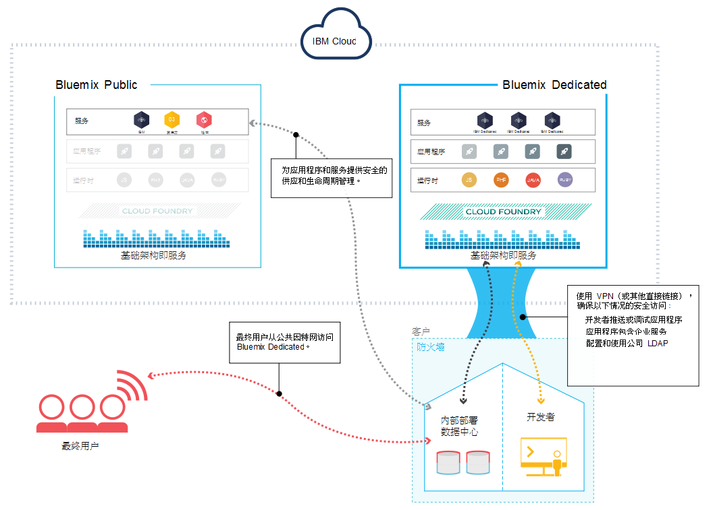

---

copyright:

  years: 2015, 2016

---

{:new_window: target="_blank"}
{:shortdesc: .shortdesc}

# {{site.data.keyword.Bluemix_notm}} Dedicated
{: #dedicated}

上次更新时间：2016 年 11 月 02 日
{: .last-updated}

由世纪互联运营的 {{site.data.keyword.Bluemix_notm}} 是一种基于云的开放标准平台，用于构建、运行和管理应用程序。通过 {{site.data.keyword.Bluemix_notm}} Dedicated，您可以在自己的专用 BlueBox 环境中享受到 {{site.data.keyword.Bluemix_notm}} 为您提供的强大功能和简便性。该专用 BlueBox 环境以安全方式连接到 {{site.data.keyword.Bluemix_notm}} Public 环境和您自己的网络。
{:shortdesc}

中国的 {{site.data.keyword.Bluemix_notm}} Dedicated 由 IBM Bluebox 提供支持，其为基于 OpenStack 的私有云基础架构。中国的 {{site.data.keyword.Bluemix_notm}} Dedicated 客户可以通过 [{{site.data.keyword.Bluemix_notm}} 支持凭单系统](https://chinabluemix.itsm.unisysedge.cn){: new_window}. 页面请求支持。此外，中国的客户还可以在 [IBM developerWorks China Developer Centers](https://developer.ibm.com/cn_answers/bluemix/){: new_window} 上获取免费支持。

无需额外付费，{{site.data.keyword.Bluemix_notm}} 的所有专用部署中都包含以下优势和功能：VPN、专用虚拟局域网 (VLAN)、防火墙、与 LDAP 的连接、利用现有内部部署数据库和应用程序的能力、全天候现场安全防护、专用硬件以及标准支持。
{{site.data.keyword.Bluemix_notm}} Dedicated 随附所有内含的 {{site.data.keyword.Bluemix_notm}} 运行时和 64 GB 计算资源内存。

此外，还有一组可作为 {{site.data.keyword.Bluemix_notm}} Dedicated 服务使用的服务，将在17年底前陆续上线。请查看下表以了解哪些已包含在内，哪些可供您购买。

*表 1. 专用服务*

| **类型**        | **名称**            | **描述** |      
|-----------------|-------------------|-------------------|
|内含 | [{{site.data.keyword.Bluemix_notm}} 运行时](../cfapps/runtimes.html) | 使用运行时可快速启动并运行应用程序，无需设置和管理计算机与操作系统。所有 {{site.data.keyword.Bluemix_notm}} 运行时都可供您在 {{site.data.keyword.Bluemix_notm}} Dedicated 实例中使用。|
| 内含 | [{{site.data.keyword.autoscaling}}](../services/Auto-Scaling/index.html) | 根据策略，动态增大或减小应用程序的计算容量。通过此服务，您在 {{site.data.keyword.Bluemix_notm}} Dedicated 环境中的使用不受限制。 |
|可选 | [{{site.data.keyword.cloudant}}](../services/Cloudant/index.html#Cloudant) | {{site.data.keyword.cloudant}} 提供了对始终启用的完全受管 NoSQL JSON 数据层的访问。此服务兼容 CouchDB，并且可通过易用的 HTTP 接口供移动和 Web 应用程序模型访问。 |
| 可选 | [{{site.data.keyword.messagehub}}](../services/MessageHub/index.html#messagehub) | {{site.data.keyword.messagehub}} 是一种可扩展的分布式消息传递总线，吞吐量高，可将内部部署和外部部署技术合并在一起。{{site.data.keyword.messagehub}} 基于 Apache Kafka，这是一种高速、耐用的可扩展实时消息传递引擎。 |
| 可选 | [{{site.data.keyword.iot_short}}](../services/IoT/index.html) | 此服务允许应用程序与连接的设备、传感器和网关进行通信，以及使用这些设备、传感器和网关收集的数据。基本产品允许在专用环境中运行 {{site.data.keyword.iot_short}} 的专用版本，容量为 100,000 个并行连接设备或应用程序，数据交换量为 1.6 TB。 |

有一些可选组件可供您购买，用于扩展资源和服务的容量。可以通过联系销售团队来购买其中任何组件。

## {{site.data.keyword.Bluemix_notm}} Dedicated 体系结构
{: #dedicatedarch}

{{site.data.keyword.Bluemix_notm}} Dedicated 基于 BlueBox 构建， 可为您提供性能最佳的云基础架构。每个数据中心都采用严格的全天候安全控制。您和世纪互联可通过 VPN 隧道以及专用 VLAN 来访问您的 {{site.data.keyword.Bluemix_notm}} 专用实例。

{{site.data.keyword.Bluemix_notm}} Dedicated 通过 VPN 或专线连接您的网络。您的单租户硬件可以在世纪互联位于北京的旗舰数据中心内进行设置。世纪互联 负责对专用平台和专用服务进行管理，所以您可以专注于构建定制应用程序。不仅如此，世纪互联还会在您所选择的维护时段内执行专用实例的所有维护工作。

*图 1. {{site.data.keyword.Bluemix_notm}} Dedicated 详图*

{{site.data.keyword.Bluemix_notm}} Dedicated 环境在基础架构、操作和物理安全方面所采用的安全标准与公共 {{site.data.keyword.Bluemix_notm}} 相同。但是，开发者对专用 {{site.data.keyword.Bluemix_notm}} 的访问由 LDAP 策略进行控制，这些策略可以由 {{site.data.keyword.Bluemix_notm}} 团队在设置您的环境时进行配置。在该专用环境中，您可以管理用户角色和许可权。有关详细信息，请参阅[管理用户和许可权](../admin/index.html#oc_useradmin)。

##设置 {{site.data.keyword.Bluemix_notm}} Dedicated
{: #setupdedicated}

{{site.data.keyword.Bluemix_notm}} Dedicated 的设计宗旨是提供专用版本的 {{site.data.keyword.Bluemix_notm}} Public 产品。您可以通过世纪互联托管的 BlueBox 帐户，使用 {{site.data.keyword.Bluemix_notm}} 服务和运行时来满足计算需求。

世纪互联为您提供了使用受密码保护的登录来访问 {{site.data.keyword.Bluemix_notm}} Dedicated 的方式。您可以访问服务、运行时和关联的资源，还可以部署和除去 {{site.data.keyword.Bluemix_notm}} 应用程序。 

要设置专用版本的 {{site.data.keyword.Bluemix_notm}}，请执行以下操作（可能会产生费用）：

<ol>
<li>首先联系世纪互联指定的客户代表或<a href="https://console.chinabluemix.net/?direct=classic/#/contactUs/cloudOEPaneId=contactUs" target="_blank">联系 {{site.data.keyword.Bluemix_notm}}</a>。</li>
<li>与世纪互联一起确定您 {{site.data.keyword.Bluemix_notm}} Dedicated 实例，费用由您支付。每月的经常性费用基于要使用的专用服务以及对所有 {{site.data.keyword.Bluemix_notm}} 公共服务的预订。对于超出预订协议范围的任何费用，您会收到相应发票。</li>
<li>为设置 {{site.data.keyword.Bluemix_notm}} Dedicated 实例的每个阶段确定截止期限。有关所涉及的每个阶段和任务的信息，请参阅 <a href="index.html#rolesresponsibilities" target="_blank">{{site.data.keyword.Bluemix_notm}} Dedicated 角色和责任</a>。</li>
<li>创建专用平台和帐户。针对您的帐户，为组织中需要启动并运行专用实例的人员分配必要的角色。有关分配的角色的信息，请参阅 <a href="index.html#rolesresponsibilities" target="_blank">{{site.data.keyword.Bluemix_notm}} Dedicated 角色和责任</a>。
</li>
<li>定义并建立企业网络与 {{site.data.keyword.Bluemix_notm}} Dedicated 实例之间的网络连接。
	<ol type="a">
	<li>世纪互联为专用实例安装监视和安全基础架构。</li>
	<li>世纪互联安装您所选的单租户专用服务。</li>
	<li>您提供网络配置和端点（IP 地址或防火墙等）以及对 LDAP 的访问权（以便集成到 {{site.data.keyword.Bluemix_notm}} 中）。</li>
	</ol>
</li>
<li>为您环境的管理团队确定并分配角色。
	<ol type="a">
	<li>世纪互联根据您提供的信息配置网络访问和 LDAP。为您指定的联系人授予管理访问权。还必须指定一名联系人来负责记帐和提供相应支持。</li>
	<li>世纪互联在您的专用环境中设置联合目录，用于显示您的专用服务。联合目录还包含从 {{site.data.keyword.Bluemix_notm}} Public 联合的其他服务，供您使用。您可以选择根据自己的数据隐私和安全标准来确定哪些公共服务满足您的业务需求。</li>
	<li>您验证网络和防火墙配置以及 LDAP 端点和访问权。</li>
	</ol>
</li>
</ol>

对您的环境进行初始部署和配置的过程应类似于以下列表。有关每个任务负责人员的详细信息，请参阅[角色和责任](index.html#rolesresponsibilities)。

<ol>
<li>您为部署指定域名，以及要使用的标识。设置 {{site.data.keyword.Bluemix_notm}} 实例时，您会得到三个域。选取 <code>*mycompany*.chinabluemix.net</code> 和 <code>*mycompany*.mychinabluemix.net</code> 的前缀。然后，选择第三个域的全名。 

您可以根据自己的需要选择任意数量的定制域。不过，您应负责获取定制域的证书。有关创建定制域的信息，请参阅<a href="../manageapps/updapps.html#domain">创建和使用定制域</a>。
</li>
<li>您确定使用哪个公共帐户的所有者来在 {{site.data.keyword.Bluemix_notm}} Public 中代表您的公司。世纪互联使用此帐户来跟踪联合服务使用情况。</li>
<li>您决定是否将允许通过公共因特网对您的专用环境进行任何访问。</li>
<li>您选择要使用的认证的类型。可选类型包括世纪互联或 Active Directory。</li>
<li>您为您环境的管理团队确定并分配角色。有关必须分配哪些角色的信息，请参阅 <a href="index.html#rolesresponsibilities" target="_blank">{{site.data.keyword.Bluemix_notm}} Dedicated 角色和责任</a>。</li>
<li>世纪互联部署核心平台，其中包含弹性运行时、控制台、管理功能和监视。</li>
<li>世纪互联配置您对环境的管理访问权。</li>
<li>您可以开始使用您的专用实例来响应警报，该实例由世纪互联操作团队进行监视。</li>
</ol>

{{site.data.keyword.Bluemix_notm}} 实例设置完成后，您可以使用“管理”页面来监视和管理 {{site.data.keyword.Bluemix_notm}} 实例。

##角色和责任
{: #rolesresponsibilities}

如果设置了 {{site.data.keyword.Bluemix_notm}} Dedicated 帐户，请为组织中需要启动并运行实例的人员分配必要的角色。

###角色

以下列表显示了分配的客户角色和责任：

<dl>
<dt>**采购联系人**</dt>
<dd>与世纪互联代表一起建立 {{site.data.keyword.Bluemix_notm}} Dedicated 环境，包括确定组织中负责项目各个方面的相应人员。分配有此角色的人员将负责项目管理，对模式选择、商业安排以及客户资源访问安排进行监督。采购联系人是设置专用实例和跟踪部署过程的总联系人。</dd>
<dt>**合规管理人员**</dt>
<dd>与世纪互联代表一起选择符合您安全需求的拓扑和部署选项。分配有此角色的人员可与世纪互联合规顾问一起确定哪些部署模式可达到合规目标。</dd>
<dt>**网络专家**</dt>
<dd>与世纪互联代表一起规划用于部署 {{site.data.keyword.Bluemix_notm}} 的网络。分配有此角色的人员负责审查世纪互联要求的联网规范，并与世纪互联一起制定实施规划。安装和验证阶段结束后，分配有此角色的人员可对网络配置是否符合公司标准进行审批。</dd>
<dt>**DevOps 联系人**</dt>
<dd>与世纪互联代表一起规划和应用 {{site.data.keyword.Bluemix_notm}} 平台、服务和运行时所需的维护更新。分配有此角色的人员还可与世纪互联代表一起配置 {{site.data.keyword.Bluemix_notm}} Dedicated 实例。</dd>
</dl>

您的客户代表会与世纪互联专家进行合作，共同来确保您始终拥有所需的支持。

在 {{site.data.keyword.Bluemix_notm}} 实例上与您合作的 {{site.data.keyword.Bluemix_notm}} 支持和运营团队可能需要访问您的本地环境，但仅出于以下原因才会这样做。

<ul>
<li>响应警报和执行操作维护</li>
<li>尝试重现支持凭单上报告的问题</li>
</ul>

###责任

从设置环境到持续维护的过程中，必须完成各种任务。下表列出了在初始化、进展和完成各阶段所需的任务以及完成任务的所有者。

先启阶段用于建立 {{site.data.keyword.Bluemix_notm}} Dedicated 环境。此阶段的主要目标包含以下内容：

- 复查财务协议，并确定交付的里程碑日期。
- 创建 {{site.data.keyword.Bluemix_notm}} 平台，并提供对运行时和服务的访问权。
- 定义并建立企业网络与 {{site.data.keyword.Bluemix_notm}} 运营之间的网络连接。
- 为管理团队确定并分配角色。

*表 4. 先启阶段任务*

| **任务** | **任务详细信息** | **责任方** |
|----------|------------------|-----------------------|
|设置合规标准 | 确定环境所需的政府、行业和专有公司标准。 | 客户 |
|创建安全和合规性集成计划 | 创建安全和集成计划，其中包含达到安全合规性所需的成本、计划安排和资源。 | 世纪互联 |
|合规性计划审批 | 审批合规性计划。 | 客户 |
|创建环境规模标准 |  	基于预定义的选项来创建环境规模标准，这些选项将高可用性、灾难恢复目标以及初始 DEA 和服务供应全部考虑在内，其中初始 DEA 和服务供应是为使用平台创建的应用程序提供支持所必需的。您和世纪互联一起定义一些内容，例如需要哪些数据库，以及在客户的联合目录中提供哪些服务等。 | 世纪互联和客户共担责任 |
|选择体系结构 | 基于预定义的选项来选择体系结构，这些选项将高可用性和灾难恢复需求考虑在内。 | 世纪互联 |
|定义灾难恢复目标 | 为环境定义灾难恢复需求。 | 客户 |
|创建灾难恢复计划 | 协商和定义灾难恢复计划。世纪互联创建灾难恢复模型，并与您协商在何处由您提供反馈和审批计划。 | 世纪互联和客户共担责任 |
|创建备份和恢复计划 | 创建备份和恢复计划，其中定义现场和非现场分布的备份的频率和需求。世纪互联备份平台组件、世纪互联服务、服务元数据（包括用户角色）等。您备份自己负责的任何特定于应用程序的数据。 | 世纪互联 和客户共担责任 |
|确定用于事件检测和问题确定的工具 | 确定用于在 {{site.data.keyword.Bluemix_notm}} 平台级别进行事件检测和问题确定的世纪互联和第三方工具。 | 世纪互联 |
|定义上报计划 | 定义上报计划以分类和解决从监视组件检测到的事件。 | 世纪互联 |
|签署基础架构、平台和支持协议 | 签署预订协议，包括环境的财务条款和条件。签署支持预订。 | 客户 |
|采购环境 | 采购计算资源、网络和存储，包括用于托管 {{site.data.keyword.Bluemix_notm}} 的核心和服务 VLAN、用于托管 DataPower 的裸机服务以及 {{site.data.keyword.Bluemix_notm}} 防火墙。提供基础架构以允许使用 VPN 隧道。 | 世纪互联 |
|安装平台、应用程序以及监视和管理组件 | 安装、配置和验证平台组件（例如 BOSH Director、云控制器、运行状况管理器、消息传递、路由器、DEA 和服务提供者），以及在上报和问题检测计划中定义的监视组件。 | 世纪互联 |
|安装和配置安全组件 | 安装和配置与监视和上报计划绑定的安全组件，包括 IBM QRadar、凭证保险库、入侵防御系统、IBM BigFix 和 IBM Security Privileged Identity Management。 | 世纪互联 |
|安装和配置定制组件 |  	安装和配置位于 {{site.data.keyword.Bluemix_notm}} 产品和服务范围之外的定制组件。 | 客户 |
|建立初始网络配置 | 建立初始网络配置，包括防火墙、DataPower、Fortigate 和 DNS。 | 世纪互联 |
|连接 {{site.data.keyword.Bluemix_notm}} 管道 | 将 {{site.data.keyword.Bluemix_notm}} 持续集成和持续交付管道与世纪互联存储库相连接。 | 世纪互联 |
|定制外部解决方案组件 | 为灾难恢复方案定制负载均衡器。 | 客户 |
|安装 VPN 解决方案 | 安装双向 VPN 解决方案。 | 世纪互联 |
|配置登录服务器 | 配置登录服务器以与公司 LDAP 配合使用。 | 世纪互联 |
|跟踪安全性、合规性和审计控制的状态  | 跟踪状态，直到所有工具和流程全部落实到位，达到确定的合规性为止。 | 客户 |
|审查物理基础架构 | 审查托管解决方案组件的物理部署是否有威胁，并查看用于保护数据中心的安全性控制。 | 客户 |
|检查监视软件 | 检查上报和问题确定计划中定义的监视和管理组件。 | 客户 |
|检查操作系统 | 检查以确保操作系统映像达到合规标准。世纪互联提供对操作系统映像的访问权。 | 世纪互联和客户共担责任 |

接下来是进展阶段。进展阶段描述了您和世纪互联的持续协作关系。此阶段的主要目标包含以下内容：

- 审查容量并进行必要的调整。
- 审查维护和平台改进。
- 协调问题解决和根本原因分析活动。

*表 5. 进展阶段任务*

| **任务** | **任务详细信息** | **责任方** |
|----------|------------------|-----------------------|
|审查每周容量报告 | 审查每周容量报告，并根据需要采取纠正措施。 | 客户 |
|创建每月预测 | 收集容量和使用量信息，并创建容量和使用量的每月预测。 | 世纪互联和客户共担责任 |
|审查容量预测 | 审查容量预测，这些预测与可能影响容量的外部事件以及与预期的新应用程序部署相关。与世纪互联一起审查预测并相应地进行规划。 | 世纪互联和客户共担责任 |
|审查预测 | 审查容量预测，这些预测与可能影响容量的外部事件相关。 | 客户 |
|调整容量 |  随着需求的变化来增减容量。 | 世纪互联 |
|发布即将到来的更新和维护 | 为必需的世纪互联组件维护创建文档。 | 世纪互联 |
|执行维护 | 与世纪互联一起安排必需的维护（维护时段为 21 天）。您可以提供在 21 天的时段内可能不适合进行维护的日期，然后世纪互联会尽量相应地制定维护计划。 | 世纪互联和客户共担责任 |
|地址供应失败 | 针对部署到“目录”的客户创建的服务，解决供应失败问题（如果发生）。 | 世纪互联 |
|执行网络和 IP 扫描 | 执行每日和每月网络和 IP 扫描。 | 世纪互联和客户共担责任 |
|提供对审计日志的访问权 | 提供对所有安全和管理审计日志的访问权。   | 世纪互联和客户共担责任 |
|执行测试 | 执行定期“关键运营控制”测试和第三方渗透测试。 | 世纪互联和客户共担责任 |
|状态报告、审计协调和合规性会议  | 完成状态报告、外部审计协调以及在合规性审查状态会议上陈述。 | 世纪互联 |
|聘用和业务需求核查 | 针对有权访问客户环境的世纪互联代表，完成每季度就业核查和持续业务需求核查。 | 世纪互联 |
|解决安全漏洞 | 解决报告的平台安全漏洞。 | 世纪互联 |

最后是完成阶段，此阶段表示您和 {{site.data.keyword.Bluemix_notm}} 之间的关系结束。此阶段的主要任务包含以下内容：

* 结束财务协议
* 除去所有网络连接
* 回收基础架构

*表 6. 完成阶段任务*

| **任务** | **任务详细信息** | **责任方** |
|----------|------------------|-----------------------|
|结束财务协议 | 讨论并同意结束财务协议合同。 | 世纪互联和客户共担责任 |
|解除环境 | 关闭对环境的访问以及环境的凭证。 | 世纪互联和客户共担责任 |
|除去客户网络连接 | 除去世纪互联与客户环境之间的网络连接。 | 世纪互联和客户共担责任 |
|回收基础架构 | 基于 {{site.data.keyword.Bluemix_notm}} 定义的流程来回收您的环境。 | 世纪互联 |

<!-- Disabled per Bingbing's request on 2016/10/11

##维护专用实例
{: #maintaindedicated}

世纪互联会在世纪互联认为适当的时候，为 {{site.data.keyword.Bluemix_notm}} 运行时和服务维护并安装更新与修订。在维护时段内，服务可能会不可用。此外，世纪互联会与您合作安排对 {{site.data.keyword.Bluemix_notm}} 平台的维护更新。

{{site.data.keyword.Bluemix_notm}} Dedicated 需要以下类型的维护：
<dl>
<dt>**服务标准维护**</dt>
<dd>服务会利用预定义的标准维护时段，而这可能会导致服务不可用。世纪互联无需客户批准就能执行服务维护，但在执行维护时世纪互联会尝试尽可能减小对您服务的影响。 
 
世纪互联会发送有关在“状态”页面上针对每个维护时段计划进行哪些更改通知。 
 
**重要信息**：在维护期间，某些服务可能不可用。</dd>

<dt>**{{site.data.keyword.Bluemix_notm}} 平台标准维护**</dt>
<dd>将根据您与世纪互联的协商在 21 天时段中应用维护更新。您为世纪互联提供了预先批准的维护时段以及可能不适用于您的特定日期或时间，世纪互联会尽量将更新安排在您选择的日期内或相邻日期执行。

转至**管理 > 系统信息**以查看安排的和暂挂的维护更新。有关设置预先批准的时段、不可用的日期以及查看或批准安排的维护更新的更多信息，请参阅<a href="../admin/index.html#oc_schedulemaintenance">维护更新</a>
.</dd>
</dl>

**重要信息**：世纪互联保留在必要时中断服务来实施紧急维护的权利。世纪互联可能会更改所安排的维护时间，但会通知您任何此类更改以及任何紧急维护信息。

如果在维护更新后报告有问题，您与 {{site.data.keyword.Bluemix_notm}} 支持人员协商，允许世纪互联回滚更新是否对您最有利。世纪互联会根据商定的结果回滚更新，使环境复原到先前的状态。

Disabled part ends. 2016/10/11-->

## 事件响应和支持
{: #incidentresponse}

### 客户检测到的问题

如果识别到需要世纪互联支持和操作人员关注的问题，您可以使用 [{{site.data.keyword.Bluemix_notm}} 支持凭单系统](https://chinabluemix.itsm.unisysedge.cn){: new_window}来联系支持人员。根据问题情况，您和/或世纪互联可合作解决问题。

### 世纪互联检测到的严重事件

严重事件是指紧迫的意外服务中断以及影响您的环境或用户的稳定性问题。如果世纪互联检测到您的环境内有严重事件，那么会在**状态**页面上借助通知来告知您。您还可以检查“状态”页面来获取平台或服务的任何已知问题。有关“状态”页面的更多信息，请参阅[查看状态](../admin/index.html#oc_status)。

*图 2. 事件响应过程*

根据问题情况，您和/或世纪互联可合作解决问题。如果您有与事件相关的疑问，或者需要世纪互联代表帮助您解决问题，那么可以开具支持凭单。

## 灾难恢复
{: #dr}

{{site.data.keyword.Bluemix_short}} Dedicated 灾难恢复可按照与使用 {{site.data.keyword.Bluemix_short}} Public 时类似的方式进行设置。{{site.data.keyword.Bluemix_short}} Public 提供了持续可用的创新平台，具有多种自动防故障措施，可确保您的组织、空间和应用程序始终可用。将应用程序部署到多个地理区域可实现持续可用性，避免多个硬件或软件组件同时发生意外故障，或者整个数据中心发生故障。这样，即使一个地理位置发生自然灾害，分布在其他地理位置中的 {{site.data.keyword.Bluemix_notm}} Public 应用程序实例也会可用。
{: shortdesc}

{{site.data.keyword.Bluemix_short}} Dedicated 的灾难恢复是通过应用程序的持续可用性、平台固有的高可用性以及发生故障时恢复实例的能力来实现的。您负责通过将应用程序部署到多个区域来实现应用程序的持续可用性。高可用性是通过 Cloud Foundry 和其他组件中包含的各种技术在平台级别构建的。此外，您可以与世纪互联合作，共同来确保数据已正确备份，可随时满足您的实例复原需求。

### 高可用性
{: #ha}

{{site.data.keyword.Bluemix_notm}} 使用 Cloud Foundry 和其他组件中内置的技术，在整个平台提供高可用性。

这些技术包括以下各项：

<dl>
<dt>Cloud Foundry 中的 DEA 可扩展性</dt>
<dd>Cloud Foundry <a href="https://docs.cloudfoundry.org/concepts/architecture/execution-agent.html" target="_blank">Droplet Execution Agent (DEA)</a> 会对其中运行的应用程序执行运行状况检查。如果应用程序或 DEA 本身存在问题，那么它会将应用程序的其他实例部署到备用 DEA 来解决该问题。有关更多信息，请参阅<a href="https://docs.cloudfoundry.org/concepts/high-availability.html" target="_blank">配置 CF 以通过冗余实现高可用性</a>。
要确保应用程序的高可用性，您需要有足够的计算资源来均衡负载，并且还可能需要额外的计算资源来支持可能发生的故障。如果需要通过增大 DEA 池来扩展环境，以做好准备应对故障或满足应用程序实例高峰负载要求，您可以联系世纪互联代表来订购更多 DEA，并确保您有相应的硬件来支持添加的资源。

</dd>
<dt>Bluebox 冗余</dt>
<dd>在专用环境中使用 Bluebox 时，每个云存储集群中的数据都会被写入多次，而且存储集群都配备有在发生驱动器故障时进行自动修复的功能。如果某个虚拟服务器发生问题，BlueBox 会尝试在其他主机上重新启动该虚拟服务器。</dd>
<dt>元数据备份</dt>
<dd>利用 Bluebox 的对象存储服务，把数据备份到 Bluebox 的对象存储服务（swift）， 该对象存储本身是可伸缩、高可用的（每份数据3个副本）。</dd>
</dl>

##复原专用实例
{: #restorededicated}

系统会定期备份 {{site.data.keyword.Bluemix_notm}} Dedicated 设置、元数据和配置，以做好准备来应对环境中的任何意外中断。您负责备份的数据包括应用程序数据、云数据库服务数据和对象存储。

在数据备份过程中（包括系统元数据和配置），世纪互联会完成以下任务：

<ul>
<li>加密所有备份副本并管理加密密钥</li>
<li>监视并管理备份活动</li>
<li>提供加密的备份文件</li>
<li>复原所请求的数据</li>
</ul>

由于保护专用数据至关重要，因此世纪互联在处理备份文件管理时需要您的协作，以便不将文件移出您的数据中心。具体来说，世纪互联会要求您完成以下任务：

<ul>
<li>异地备份一份您的加密备份数据，与您所管理的任何其他备份数据的处理方法一样。</li>
<li>向世纪互联操作员提供备份文件，以防万一有任何需要复原的情况。</li>
</ul>

