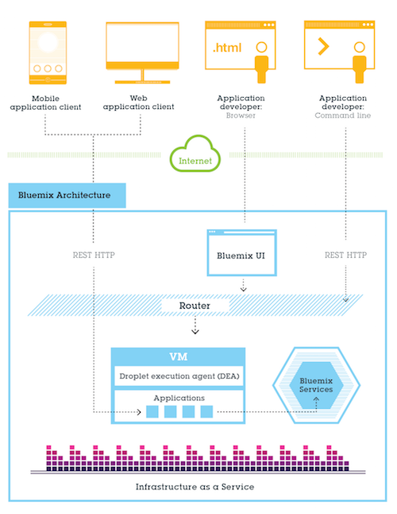
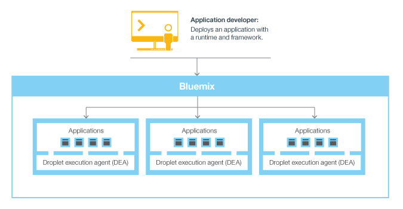
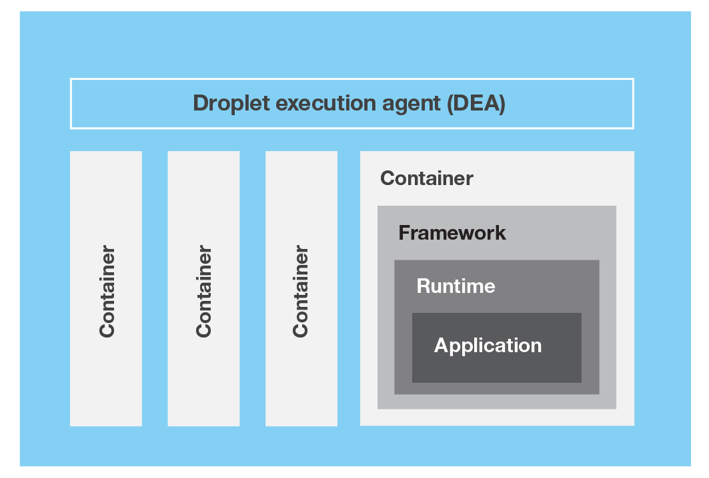
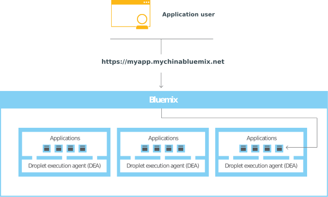

---

copyright:
  years: 2016
lastupdated: "2016-11-21"
---

{:shortdesc: .shortdesc}
{:new_window: target="_blank"}

# What is {{site.data.keyword.Bluemix_notm}}?
{: #bluemixoverview}

{{site.data.keyword.Bluemix_notm}} operated by 21ViaNet is an innovative cloud computing platform that combines platform as a service (PaaS) with infrastructure as a service (IaaS). Additionally, {{site.data.keyword.Bluemix_notm}} has a rich catalog of cloud services that can be easily integrated with PaaS and IaaS to build business applications rapidly.
{:shortdesc}

{{site.data.keyword.Bluemix_notm}} has cloud deployments that fit your needs whether you are a small business that plans to scale, or a large enterprise that requires additional isolation. You can develop in a cloud without borders, where you can connect your private services to the public {{site.data.keyword.Bluemix_notm}} services. You and your team can access the apps, services, and infrastructure in {{site.data.keyword.Bluemix_notm}} and use existing data, systems, processes, PaaS tools, and IaaS tools. Developers can tap into the rapidly growing ecosystem of available services and runtime frameworks to build applications using polyglot programming approaches.
 
With {{site.data.keyword.Bluemix_notm}}, you no longer have to make large investments in hardware to test out or run a new app. Instead, we manage it all for you and only charge for what you use. {{site.data.keyword.Bluemix_notm}} provides public, [dedicated](/docs/dedicated/index.html), and [local](/docs/local/index.html) integrated deployment models. 

You can take an idea from inception, to development sandbox, to a globally distributed production environment with compute and storage infrastructure, open source platform services, and software services, Watson, and more. Beyond the capabilities of the platform itself, {{site.data.keyword.Bluemix_notm}} also provides flexible deployment. Provision {{site.data.keyword.Bluemix_notm}} resources on-premises, in dedicated private cloud environments, or in the public cloud, and manage the resources from all three types of environments in a single dashboard.
 

{{site.data.keyword.Bluemix_notm}} enables you to:

* Deploy high performance compute and storage infrastructure in secure cloud data centers.
* Test and adopt a broad range of cloud services and capabilities from {{site.data.keyword.IBM_notm}}, open source communities, and third-party developers.
* Connect to all of your legacy systems and apps from a single, scalable, cloud platform through private network and API capabilities.
* Spin up and turn down resources in real time as your business needs or workload demands change.

### Apps
{: #bluemixoverviewapplications}

The Apps dashboard provides everything you need to get your apps up and running, and to manage those apps while they run. {{site.data.keyword.Bluemix_notm}} provides various boilerplates and runtimes:

* A boilerplate is a template for an application and its associated runtime environment and predefined services for a specific domain. 
* A runtime is the set of resources that is used to run an app, provided as containers for different types of apps.

{{site.data.keyword.Bluemix_notm}} provides various ways for you to run your apps.

 
You can use {{site.data.keyword.Bluemix_notm}} Mobile services to incorporate pre-built, managed, and scalable cloud services into your mobile apps. 

### Services
{: #bluemixoverviewservices}

The Services dashboard provides access to the {{site.data.keyword.Bluemix_notm}} services available from {{site.data.keyword.IBM_notm}} and third-party providers. These include Watson, Internet of Things, Analytics, Mobile, and DevOps services:

* Deliver innovative new applications faster and cheaper with just the right features using DevOps services and the {{site.data.keyword.Bluemix_notm}} Garage Method. When you adopt DevOps practices and create a culture of innovation and agility, you can use iterative practices and change direction in response to the market.
* Blockchain is a peer-to-peer distributed ledger technology for a new generation of transactional applications that establishes trust, accountability, and transparency while streamlining business processes.  
* Watson gives your apps the power of cognitive computing with a full suite of speech, vision, and data APIs.  Solve your most complex business problems by deploying a cognitive platform with Watson services.
* {{site.data.keyword.Bluemix_notm}} enables you to do more with rich, integrated cloud databases and Data & Analytics services. 
* The Internet of Things service lets your apps communicate with, and consume data that is collected by, your connected devices, sensors, and gateways. Our recipes make it easy to get devices connected to our Internet of Things cloud. Your apps can then use our real-time and REST APIs to communicate with your devices and consume the data you've set them up to collect. 
* {{site.data.keyword.Bluemix_notm}} offers a mobile backend infrastructure where you can build multiplatform, native, or hybrid apps while also being able to monitor and test them. You can also enhance your app with analytics, security, user insight, and continuous delivery. 
 
{{site.data.keyword.Bluemix_notm}} also provides experimental services that you can try out. To learn about service types and availability, see [{{site.data.keyword.Bluemix_notm}} services](/docs/services/index.html).

### Infrastructure
{: #bluemixoverviewinfrastructure}

The Infrastructure dashboard provides various services to fit your cloud infrastructure needs.

{{site.data.keyword.Bluemix_notm}} infrastructure provides the highest performing cloud infrastructure available. {{site.data.keyword.Bluemix_notm}} infrastructure is one platform, which takes data centers around the world that are full of the widest range of cloud computing options, then integrates and automates everything. Cloud data centers are filled with first class computing, storage, and networking gear. Each location is built, outfitted, and operated in the same way, so you get exactly the same capabilities and availability anywhere in our footprint. Locations are connected by the industry’s most advanced network-in-a-network, which integrates distinct public, private, and internal management networks to deliver lower total networking costs, better access, and higher speed. Also, the data centers and network share a single proprietary management system. One management tool lets you control everything--every bare metal server, virtual server, and storage device--all accessible by API, portal, and mobile applications.

{{site.data.keyword.Bluemix_notm}} infrastructure offers powerful bare metal servers and flexible virtual servers in a single seamless platform. All are provided on demand and billed on monthly or hourly terms. Bare metal servers provide the raw horsepower for your processor-intensive and disk I/O-intensive workloads and can be configured to your exact specifications. Virtual servers allow for high speed of deployment, flexible scalability, and pay-as-you-go billing. For high performance computing, give your cloud a boost with graphics processing unit (GPU) servers, available by the hour or monthly. 

{{site.data.keyword.Bluemix_notm}} infrastructure offerings are connected to a three-tiered network, segmenting public, private, and management traffic. Infrastructure on a customer's {{site.data.keyword.Bluemix_notm}} account might transfer data between one another across the private network at no cost. Infrastructure offerings, such as bare metal servers, virtual servers, and cloud storage, connect to other applications and services in the {{site.data.keyword.Bluemix_notm}} catalog, such as Watson services, containers, or runtimes, across the public network. Data transfer between those two types of offerings is metered and charged at standard public network bandwidth rates.

## Using the {{site.data.keyword.Bluemix_notm}} console
{: #bluemixoverviewui}

When you access the {{site.data.keyword.Bluemix_notm}} console, the menu bar displays links or buttons to sign up, log in, access documentation, and access the catalog. After you log in, the menu bar contains a hamburger menu  and additional links, depending on your account type:

* If you are a new {{site.data.keyword.Bluemix_notm}} user, you can use the hamburger menu  to switch between the Apps, Services, or Infrastructure dashboards. Links to support and account options are displayed, and you can use the **Catalog** link to access {{site.data.keyword.Bluemix_notm}}, compute, and infrastructure services. 

* If you are an existing user with a {{site.data.keyword.Bluemix_notm}} account, you can use the hamburger menu  to switch between the Apps and Services dashboards. Links to support and account options are displayed, and you can use the **Catalog** link to access {{site.data.keyword.Bluemix_notm}} and  compute services. 

## {{site.data.keyword.Bluemix_notm}} public architecture
{: #architecture}

In general, you don't have to worry about the operating system and infrastructure layers when running apps on {{site.data.keyword.Bluemix_notm}} in Cloud Foundry. Layers such as root filesystems and middleware components are abstracted so that you can focus on your application code. However, you can learn more about these layers if you need specifics on where your app is running. 

See [Viewing {{site.data.keyword.Bluemix_notm}} infrastructure layers](/docs/manageapps/infra.html#viewinfra) for details.

As a developer, you can interact with the {{site.data.keyword.Bluemix_notm}} infrastructure by using a browser-based user interface. You can also use a Cloud Foundry command line interface, called cf, to deploy web apps.

Clients--which can be mobile apps, apps that run externally, apps that are built on {{site.data.keyword.Bluemix_notm}}, or developers that are using browsers--interact with the {{site.data.keyword.Bluemix_notm}}-hosted apps. Clients use REST or HTTP APIs to route requests through {{site.data.keyword.Bluemix_notm}} to one of the app instances or the composite services.

The following figure shows the high-level {{site.data.keyword.Bluemix_notm}} architecture.

Figure 1. {{site.data.keyword.Bluemix_notm}} architecture

## How {{site.data.keyword.Bluemix_notm}} works
{: #howwork}

When you deploy an app to {{site.data.keyword.Bluemix_notm}}, you must configure {{site.data.keyword.Bluemix_notm}} with enough information to support the app.

* For a mobile app, {{site.data.keyword.Bluemix_notm}} contains an artifact that represents the mobile app's back end, such as the services that the mobile app uses to communicate with a server.
* For a web app, you must ensure that information about the runtime and framework is communicated to {{site.data.keyword.Bluemix_notm}}, so that {{site.data.keyword.Bluemix_notm}} can set up the appropriate execution environment to run the app.

Each execution environment, including both mobile and web, is isolated from the execution environment of other apps. The execution environments are isolated even though these apps are on the same physical machine. The following figure shows the basic flow of how {{site.data.keyword.Bluemix_notm}} manages the deployment of apps:

Figure 2. Deploying an app

When you create an app and deploy it to {{site.data.keyword.Bluemix_notm}}, the {{site.data.keyword.Bluemix_notm}} environment determines an appropriate virtual server to send the app, or the artifacts that the app represents, to. For a mobile app, a mobile back-end projection is created on {{site.data.keyword.Bluemix_notm}}. Any code for the mobile app running in the cloud eventually runs in the {{site.data.keyword.Bluemix_notm}} environment. For a web app, the code running in the cloud is the app itself that the developer deploys to {{site.data.keyword.Bluemix_notm}}. The determination of the virtual server is based on several factors, including:

* The load already on the machine
* Runtimes or frameworks supported by that virtual server.

After a virtual server is chosen, an application manager on each virtual server installs the appropriate framework and runtime for the app. Then, the app can be deployed into that framework. When the deployment completes, the application artifacts are started.

The following figure shows the structure of a virtual server, also known as Droplet execution agent (DEA), that has multiple apps deployed to it:

Figure 3. Design of a virtual server

In each virtual server, an application manager communicates with the rest of the {{site.data.keyword.Bluemix_notm}} infrastructure, and manages the apps that are deployed to this virtual server. Each virtual server has containers to separate and protect apps. In each container, {{site.data.keyword.Bluemix_notm}} installs the appropriate framework and runtime that are required for each app.

When the app is deployed, if it has a web interface (as for a Java web app), or other REST-based services (such as mobile services exposed publicly to the mobile app), users of the app can communicate with it by using normal HTTP requests.

Figure 4. Invoking a {{site.data.keyword.Bluemix_notm}} app

Each app can have one or more URLs associated with it, but they must all point to the {{site.data.keyword.Bluemix_notm}} endpoint. When a request comes in, {{site.data.keyword.Bluemix_notm}} examines the request, determines which app it is intended for, then selects an instance of the app to receive the request.

   

### {{site.data.keyword.Bluemix_notm}} resilience
{: #resiliency}

{{site.data.keyword.Bluemix_notm}} is designed to host scalable resilient apps and application artifacts that can scale to meet your needs, remain highly available, and be quick to recover from problems. {{site.data.keyword.Bluemix_notm}} separates components that track the state of interactions (stateful) from components that do not (stateless). This separation allows {{site.data.keyword.Bluemix_notm}} to move apps flexibly as needed to achieve scalability and resilience.

You can have one or more instances running for your app. For multiple instances of a single app, the app is uploaded only once. However, {{site.data.keyword.Bluemix_notm}} deploys the number of instances of the app requested, and distributes them across as many virtual servers as possible.

You must save all persistent data in a stateful data store that is outside of your app, such as on one of the data store services that {{site.data.keyword.Bluemix_notm}} provides. Because anything cached in memory or on disk might not be available even after a restart, you can use the memory space or file system of a single {{site.data.keyword.Bluemix_notm}} instance as a brief single-transaction cache. With a single instance setup, the request to your app might be interrupted because of the stateless nature of {{site.data.keyword.Bluemix_notm}}. A best practice is to use at least three instances for each app to ensure the availability of your app.

All {{site.data.keyword.Bluemix_notm}} infrastructure, Cloud Foundry components, and {{site.data.keyword.IBM_notm}}-specific management components are highly available. Multiple instances of the infrastructure are used to balance the load.

### Integration with systems of record
{: #sor}

{{site.data.keyword.Bluemix_notm}} can help developers by connecting two broad categories of systems in a cloud environment: 

* *Systems of record* include apps and databases that store business records and automate standardized processes. 
* *Systems of engagement* are capabilities that expand the usefulness of systems of record and make them more engaging to users.

By integrating a system of record with the app that you create in {{site.data.keyword.Bluemix_notm}}, you can perform the following actions:

 * Enable secure communication between the app and the back-end database by downloading and installing a secure connector on premise.
 * Invoke a database in a secure way.
 * Create APIs from integration flows with databases and back-end systems, such as customer relationship management system.
 * Expose only the schemas and tables that you want to be exposed to the app.
 * As a {{site.data.keyword.Bluemix_notm}} organization manager, publish an API as a private service that is visible only to your organization members.
 

    

    

#### Scenario: Creating a rich mobile app to connect with your system of record
{: #scenario}

{{site.data.keyword.Bluemix_notm}} provides a platform where you can integrate your mobile app, cloud services, and enterprise systems of record to provide an app that interacts with your on-premises data.

For example, you can build a mobile app to interact with your customer relationship management system that resides on-premises behind a firewall. You can invoke the system of record in a secure way and leverage the mobile services in {{site.data.keyword.Bluemix_notm}} so that you can build a rich mobile app.

First, your integration developer creates the mobile back-end app in {{site.data.keyword.Bluemix_notm}}. They use the Mobile Cloud boilerplate that uses the Node.js runtime that they are most familiar with.

Then, by using the Cloud Integration service in the {{site.data.keyword.Bluemix_notm}} user interface, they expose an API through a secure connector. Your integration developer downloads the secure connector and installs it on-premises to enable secure communication between his API and the database. After they create the database endpoint, they can look at all the schemas and extract the tables that they want to expose as APIs to the app.

The integration developer adds the Push service to deliver mobile notifications to interested consumers. They also add a business partner service to tweet when a new customer record is created with a Twitter API.

Next, as the application developer, you can log in to {{site.data.keyword.Bluemix_notm}}, download the Android development toolkit, and develop code that invokes the APIs that your integration developer created. You can develop a mobile app that enables users to enter their information on their mobile device. The mobile app then creates a customer record in the customer management system. When the record is created, the app pushes a notification to a mobile device and initiates a tweet about the new record.

## {{site.data.keyword.Bluemix_notm}} prerequisites
{: #prereqs}

The prerequisites for using the {{site.data.keyword.Bluemix_notm}} platform are limited, but we do have a few. {:shortdesc}

### Browsers
{: #browsers}

The following list specifies the minimum required browser software for {{site.data.keyword.Bluemix_notm}}:
 * Chrome: latest version for your operating system
 * Firefox: latest version for your operating system and ESR 38
 * Internet Explorer: version 11
 * Safari: latest version for Mac
 
### Cloud Foundry
{: #cf} 

Cloud Foundry command line interface, Version 6.5.1 or later 

# rellinks
## general
* [What's new in {{site.data.keyword.Bluemix_notm}}](/docs/whatsnew/index.html)
* [{{site.data.keyword.Bluemix_notm}} Prerequisites](https://developer.ibm.com/bluemix/support/#prereqs)
* [{{site.data.keyword.Bluemix_notm}} known issues](https://developer.ibm.com/bluemix/support/#issues)
* [Managing your account](/docs/admin/adminpublic.html#mngacct)
* [{{site.data.keyword.Bluemix_notm}} glossary](/docs/overview/glossary/index.html)
