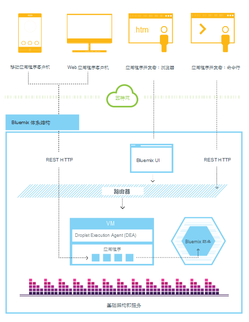
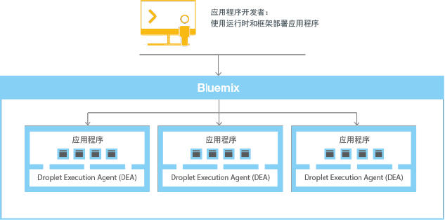
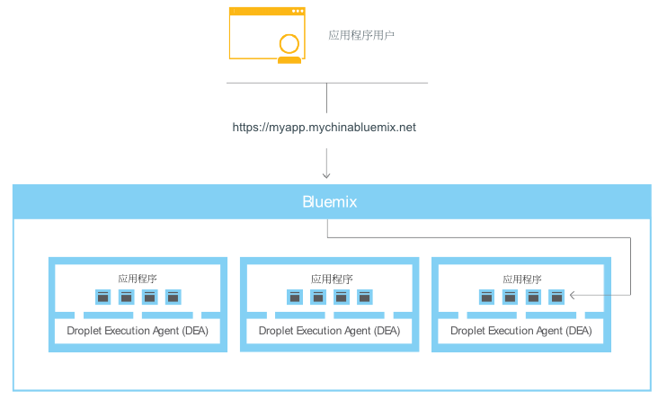

---

 

copyright:

  years: 2016

 

---

{:shortdesc: .shortdesc}
{:new_window: target="_blank"}

# {{site.data.keyword.Bluemix_notm}} Public
{: #public}
上次更新时间：2016 年 8 月 29 日
{: .last-updated}

{{site.data.keyword.Bluemix_notm}} 剥离与托管和管理基于云的应用程序相关的大部分复杂性并隐藏起来。作为应用程序开发者，您可以只关注应用程序开发，而不必管理托管应用程序所需的基础架构。
{:shortdesc}

{{site.data.keyword.Bluemix_notm}} 具有可满足您需求的云部署。无论是计划扩大规模的小企业，还是需要额外隔离机制的大企业，都可以在云中进行无边界开发，在这里您可以将专用服务连接到 {{site.data.keyword.IBM_notm}} 以及第三方供应商提供的公共 {{site.data.keyword.Bluemix_notm}} 服务。所有服务实例均由 {{site.data.keyword.IBM_notm}} 管理，而您只需要为自己选择使用的服务付费。

{{site.data.keyword.Bluemix_notm}} 的核心是一个环境，供您开发应用程序和使用服务（服务可提供即取即用的功能）。针对 Liberty 等应用程序服务器上运行的应用程序工件，{{site.data.keyword.Bluemix_notm}} 还提供了托管环境。在此环境中，应用程序可以使用预构建的服务（包括第三方服务），这使得组装应用程序变得更容易。

对于移动应用程序和 Web 应用程序，可以使用 {{site.data.keyword.Bluemix_notm}} 提供的预构建服务。可以将 Web 应用程序上传到 {{site.data.keyword.Bluemix_notm}}，并指示要运行的实例数。部署应用程序后，可以在应用程序的使用情况或负载发生变化时，轻松地增加或减少应用程序数。

通过 {{site.data.keyword.Bluemix_notm}} 中的一系列服务和运行时，开发者不仅可以获得控制力和灵活性，还可以选择使用从预测性分析到大数据等各种数据。

{{site.data.keyword.Bluemix_notm}} 提供了以下功能：

- 一系列服务，支持快速构建和扩展 Web 应用程序和移动应用程序。
- 可持续交付应用程序更改的处理能力。
- 有针对性的编程模型和服务。
- 可管理服务和应用程序。
- 经过优化的弹性工作负载。
- 持续可用性。

通过 {{site.data.keyword.Bluemix_notm}}，您可以使用最流行的编程语言来快速开发应用程序。可以使用 iOS、Android 以及 HTML 搭配 JavaScript 来开发移动应用程序。对于 Web 应用程序，可以使用 Ruby、PHP、Java&trade;、Go 和 Python 等语言。还可以将现有应用程序迁移到 {{site.data.keyword.Bluemix_notm}}，并使用 {{site.data.keyword.Bluemix_notm}} 提供的运行时来运行应用程序。

{{site.data.keyword.Bluemix_notm}} 还提供了中间件服务，供应用程序使用。{{site.data.keyword.Bluemix_notm}} 会在供应新服务实例并将这些服务与应用程序绑定时代表应用程序执行操作。这样，应用程序就可以执行其真正的工作，而将服务的管理留给基础架构来执行。

## {{site.data.keyword.Bluemix_notm}} Public 体系结构
{: #publicarch}

通常，在 {{site.data.keyword.Bluemix_notm}} 上运行应用程序时，您不必担心操作系统和基础架构层。诸如根文件系统和中间件组件这样的层已进行抽象化，以便您可以重点关注自己的应用程序代码。但是，如果需要有关应用程序运行位置的具体信息，可以了解有关这些层的更多信息。有关详细信息，请参阅[查看 {{site.data.keyword.Bluemix_notm}} 基础架构层](../cli/vcapsvc.html#viewinfra)。

作为开发者，您可以使用基于浏览器的用户界面与 {{site.data.keyword.Bluemix_notm}} 基础架构进行交互。还可以使用名为 cf 的 Cloud Foundry 命令行界面来部署 Web 应用程序。

不管是客户机（移动应用程序、外部运行的应用程序、基于 {{site.data.keyword.Bluemix_notm}} 构建的应用程序等）还是使用浏览器的开发者，都可以与 {{site.data.keyword.Bluemix_notm}} 托管的应用程序进行交互。客户机使用 REST 或 HTTP API 通过 {{site.data.keyword.Bluemix_notm}} 将请求路由到某个应用程序实例或组合服务。

下图显示了高层次的 {{site.data.keyword.Bluemix_notm}} 体系结构。

*图 1. {{site.data.keyword.Bluemix_notm}} 体系结构*

### {{site.data.keyword.Bluemix_notm}} 的工作方式
{: #howwork}

将某个应用程序部署到 {{site.data.keyword.Bluemix_notm}} 时，必须使用足够的信息来配置 {{site.data.keyword.Bluemix_notm}} 才能支持该应用程序。

* 对于移动应用程序，{{site.data.keyword.Bluemix_notm}} 包含表示移动应用程序后端的工件，例如移动应用程序用于与服务器进行通信的服务。
* 对于 Web 应用程序，必须确保将正确的运行时和框架相关信息传递给 {{site.data.keyword.Bluemix_notm}}，以便其能够设置正确的执行环境来运行应用程序。

每个执行环境（包括移动应用程序和 Web 应用程序）都与其他应用程序的执行环境相隔离。即使这些应用程序位于同一物理机器上，其执行环境也相互隔离。下图显示了 {{site.data.keyword.Bluemix_notm}} 如何管理应用程序部署的基本流程：

*图 5. 部署应用程序*

创建应用程序并将其部署到 {{site.data.keyword.Bluemix_notm}} 时，{{site.data.keyword.Bluemix_notm}} 环境会确定将应用程序或应用程序所表示的工件发送到哪个相应的虚拟服务器。对于移动应用程序，将在 {{site.data.keyword.Bluemix_notm}} 上创建移动后端投影。在云中运行的移动应用程序的任何代码最终都会在 {{site.data.keyword.Bluemix_notm}} 环境中运行。对于 Web 应用程序，在云中运行的代码是开发者部署到 {{site.data.keyword.Bluemix_notm}} 的应用程序本身。确定虚拟服务器时会考虑若干因素，包括：

* 机器上的已有负载
* 该虚拟服务器支持的运行时或框架。

选择虚拟服务器后，每个虚拟服务器上的应用程序管理器都会为应用程序安装正确的框架和运行时。然后，可以将应用程序部署到该框架。部署完成后，将启动应用程序工件。

下图显示部署了多个应用程序的虚拟服务器（也称为 Droplet Execution Agent (DEA)）的结构：

*图 6. 虚拟服务器的设计*

在每个虚拟服务器中，应用程序管理器都会与 {{site.data.keyword.Bluemix_notm}} 基础架构的其余部分进行通信，并会对部署到此虚拟服务器的应用程序进行管理。每个虚拟服务器都具有容器，用于隔离和保护应用程序。在每个容器中，{{site.data.keyword.Bluemix_notm}} 会安装每个应用程序所需的相应框架和运行时。

部署应用程序后，如果该应用程序具有 Web 接口（例如 Java Web 应用程序）或其他基于 REST 的服务（例如向移动应用程序公开的移动服务），那么该应用程序的用户可以使用正常的 HTTP 请求与其进行通信。

*图 7. 调用 {{site.data.keyword.Bluemix_notm}} 应用程序*

每个应用程序都可以有一个或多个 URL 与之相关联，但所有这些 URL 都必须指向 {{site.data.keyword.Bluemix_notm}} 端点。当请求到达时，{{site.data.keyword.Bluemix_notm}} 会检查该请求，确定该请求针对的是哪个应用程序，然后选择某个应用程序实例来接收该请求。

## {{site.data.keyword.Bluemix_notm}} 弹性
{: #resiliency}

{{site.data.keyword.Bluemix_notm}} 能够托管可扩展的弹性应用程序和应用程序工件，它们不但可根据您的需求进行扩展，而且还可以始终保持高度可用且可从问题中快速恢复。{{site.data.keyword.Bluemix_notm}} 将那些跟踪交互状态（有状态）的组件与那些不跟踪交互状态（无状态）的组件分隔开来。通过这种分隔，{{site.data.keyword.Bluemix_notm}} 可以根据需要灵活地移动应用程序，从而实现可扩展性和弹性。

您的应用程序可以有一个或多个实例正在运行。当一个应用程序具有多个实例时，仅会将该应用程序上传一次。不过，{{site.data.keyword.Bluemix_notm}} 会部署所请求数目的应用程序实例，并将它们分布到尽可能多的虚拟服务器上。

您必须在应用程序外部的有状态数据存储（例如，在 {{site.data.keyword.Bluemix_notm}} 提供的某个数据存储服务上）中保存所有持久数据。因为内存中或磁盘上高速缓存的任何内容即使在重启后也可能不可用，所以您可以将单个 {{site.data.keyword.Bluemix_notm}} 实例的内存空间或文件系统用作短暂的单个事务高速缓存。设置单个实例时，对应用程序的请求可能会由于 {{site.data.keyword.Bluemix_notm}} 的无状态性质而中断。最佳做法是每个应用程序至少使用三个实例，以确保应用程序的可用性。

所有 {{site.data.keyword.Bluemix_notm}} 基础架构、Cloud Foundry 组件和特定于 {{site.data.keyword.IBM_notm}} 的管理组件都具有高可用性。通过使用多个基础架构实例来平衡负载。

## 与记录系统集成
{: #sor}

在云环境中，{{site.data.keyword.Bluemix_notm}} 可以通过连接以下两大类别的系统来为开发者提供帮助：记录系统和全接触系统。

*记录系统*包含用于存储业务记录和自动执行标准化过程的应用程序和数据库。*全接触系统*是用于扩展记录系统用途并使其更吸引用户的功能。通过将记录系统与在 {{site.data.keyword.Bluemix_notm}} 中创建的应用程序集成，可以执行以下操作：

 * 通过下载并安装内部部署的安全连接器，启用应用程序与后端数据库之间的安全通信。
 * 以安全方式调用数据库。
 * 根据包含数据库和后端系统（例如客户关系管理系统）的集成流创建 API。
 * 仅公开要向应用程序公开的模式和表。
 * 以 {{site.data.keyword.Bluemix_notm}} 组织管理员身份，将 API 发布为仅供您的组织成员查看的私有服务。

### 场景：创建富移动应用程序以与记录系统相连接
{: #scenario}

{{site.data.keyword.Bluemix_notm}} 提供了一个平台，在该平台中可以集成移动应用程序、云服务和企业记录系统，从而提供可与内部部署数据进行交互的应用程序。

例如，可以构建移动应用程序来与客户关系管理系统进行交互，该系统位于防火墙后的内部部署中。您可以通过安全方式调用记录系统，并利用 {{site.data.keyword.Bluemix_notm}} 中的移动服务来构建富移动应用程序。

首先，集成开发者会在 {{site.data.keyword.Bluemix_notm}} 中创建移动后端应用程序。他会使用“移动云”样板，该样板使用了他最熟悉的 Node.js 运行时。

接着，他会在 {{site.data.keyword.Bluemix_notm}} 用户界面中使用 Cloud Integration 服务，通过安全连接器公开 API。集成开发者会下载安全连接器，并将其安装在内部部署中，以实现其 API 与数据库之间的安全通信。创建数据库端点后，他可以查看所有模式，并抽取要作为 API 向应用程序公开的表。

集成开发者会添加 Push 服务，用于向相关使用者发送移动通知。此外，他还会添加业务合作伙伴服务，用于在使用 Twitter API 创建新的客户记录后发布推特。

接着，作为应用程序开发者，您可以登录到 {{site.data.keyword.Bluemix_notm}}，下载 Android 开发工具箱，然后开发用于调用集成开发者所创建 API 的代码。您可以开发一个移动应用程序，使用户能够在其移动设备上输入信息。然后，该移动应用程序会在客户管理系统中创建客户记录。创建记录后，该应用程序会向移动设备推送通知，然后发布有关新记录的推特。

# 相关链接
## 常规
* [{{site.data.keyword.Bluemix_notm}} 中的新增功能](../whatsnew/index.html)
* [{{site.data.keyword.Bluemix_notm}} 先决条件](https://developer.ibm.com/bluemix/support/#prereqs)
* [{{site.data.keyword.Bluemix_notm}} 已知问题](https://developer.ibm.com/bluemix/support/#issues)
* [管理您的帐户](../admin/adminpublic.html#mngacct)
* [{{site.data.keyword.Bluemix_notm}} 词汇表](../overview/glossary/index.html)
