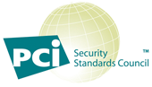

---

 

copyright:

  years: 2015，2016
lastupdated: "2015-12-15"
 

---

{:shortdesc: .shortdesc}
{:new_window: target="_blank"}

# Security compliance
{: #compliance}

 <!-- Testing format -->

{{site.data.keyword.Bluemix_notm}} provides a secure cloud platform that you can trust. The Bluemix platform and services are built on best-in-industry standards, including ISO 27001, ISO 27002, and SOC 2.
{:shortdesc}

 A **European Union (EU) Model Clause** is an agreement to protect personal data that is transferred from the EU or European Economic Area (EEA) to a third country. The EU Model Clause is signed between the client located in the EU or EEA as the data exporter, and the IBM data processor located in the third country as the data importer. The IBM SaaS EU Model Clause contains the rights and obligations of the data exporter and the data importer, and the rights of the data subjects. The IBM SaaS EU Model Clause ensures that personal data, when processed in a third country, is under protection that is similar to the protection available within the EU or EEA.

  For banking and related financial institutions in Japan, computer systems must have security procedures in place that are based on the Center for Financial Industry Information Systems (FISC) security guidelines. **FISC** security guidelines are enforced by the Japan Financial Services Agency (FSA), Bank of Japan (BOJ), and FISC.
 
  Bluemix is certified under the **International Organization for Standardization (ISO) 27001 and 27002 standards**, which define the best practices for information security management processes. The ISO 27001 standard specifies the requirements for establishing, implementing, and documenting Information Security Management Systems (ISMS) and the requirements for implementing security controls, according to the needs of individual organizations. The ISO 27002 standard explains each security control of ISO 27001 in detail. The ISO 27000 family of standards incorporates a process of scaling risk and valuation of assets, with the goal of safeguarding the confidentiality, integrity, and availability of the written, oral, and electronic information. 

Bluemix is audited by a third-party security firm and meets all of the requirements for ISO 27001: Bluemix ISO 27001:2015 Certificate of Registration.

 **Service Organization Controls (SOC)** reports define the evaluation of the leading internal control practices that relate to security, availability, processing integrity, confidentiality, and privacy at a service organization. The reports that are generated by using the American Institute of Certified Public Accountants (AICPA) Guide include the following items: 

  * Organization oversight
  * Vendor management program
  * Internal corporate governance and risk management processes
  * Regulatory oversight
 

For more information about Bluemix security and compliance, see [IBM SaaS security](http://www.ibm.com/cloud-computing/built-on-cloud/saas-security){:new_window}.

 
 <!-- testing format ends -->

<!-- DRAFT VERSIONS -->

# DRAFT VERSIONS

**EU Model Clause**

A European Union (EU) Model Clause is an agreement to protect personal data that is transferred from the EU or European Economic Area (EEA) to a third country. The EU Model Clause is signed between the client located in the EU or EEA as the data exporter, and the IBM data processor located in the third country as the data importer. The IBM SaaS EU Model Clause contains the rights and obligations of the data exporter and the data importer, and the rights of the data subjects. The IBM SaaS EU Model Clause ensures that personal data, when processed in a third country, is under protection that is similar to the protection available within the EU or EEA.

**FISC**

For banking and related financial institutions in Japan, computer systems must have security procedures in place that are based on the Center for Financial Industry Information Systems (FISC) security guidelines. FISC security guidelines are enforced by the Japan Financial Services Agency (FSA), Bank of Japan (BOJ), and FISC.

**HIPAA**

The Health Insurance Portability and Accountability Act (HIPAA), enacted by the US Congress in 1996, protects health insurance coverage for employees after job loss. HIPAA is regulated and enforced by the Office of Civil Rights and Department of Health and Human Services in the US. HIPAA encompasses regulations from the 1996 act, as well as privacy requirements from the Health Information Technology for Economic and Clinical Health (HITECH) Act of 2009.

For more information or assistance to achieve, certify, and maintain HIPAA compliance for your Bluemix environment, contact the {{site.data.keyword.Bluemix_notm}} [sales](mailto:cloudplatform_compliance@us.ibm.com){:new_window} team.

**IDA MTCS**

The Multi-Tier Cloud Security (MTCS) standard, from Infocomm Development Authority of Singapore (IDA), defines levels of security for cloud computing. The purpose of the standard is to promote the adoption of cloud computing, and to provide accountability for cloud service providers (CSPs). 

MTCS defines a multi-tiered framework, which enables CSPs to apply a common standard to meet different cloud user needs for data sensitivity and business-critical operations.

MTCS also includes disclosure and security reporting, which improves the information transparency and visibility of risks that are associated with the services and security practices of the CSPs.

For more information or assistance to achieve, certify, and maintain MTCS compliance for your Bluemix environment, contact the {{site.data.keyword.Bluemix_notm}} [sales](mailto:cloudplatform_compliance@us.ibm.com){:new_window} team.

**ISO 27001 and ISO 27002**

Bluemix is certified under the International Organization for Standardization (ISO) 27001 and 27002 standards, which define the best practices for information security management processes. The ISO 27001 standard specifies the requirements for establishing, implementing, and documenting Information Security Management Systems (ISMS) and the requirements for implementing security controls, according to the needs of individual organizations. The ISO 27002 standard explains each security control of ISO 27001 in detail. The ISO 27000 family of standards incorporates a process of scaling risk and valuation of assets, with the goal of safeguarding the confidentiality, integrity, and availability of the written, oral, and electronic information. 

Bluemix is audited by a third-party security firm and meets all of the requirements for ISO 27001: Bluemix ISO 27001:2015 Certificate of Registration.

**PCI DSS**

The Payment Card Industry Data Security Standard (PCI DSS) helps organizations that process card payments to prevent credit card fraud through increased controls around data and its exposure to compromise.

PCI DSS applies to all of the services that are provided by a business entity, excluding the following entities:
  * A payment card brand member or a merchant who is directly involved in the processing, storing, transferring, and switching transaction data or cardholder information, or both
  * Companies that provide services to merchants, service providers, or members that control or might impact the security of the cardholder data
  
For more information or assistance to achieve, certify, and maintain PCI compliance for your Bluemix environment, contact the {{site.data.keyword.Bluemix_notm}} [sales](mailto:cloudplatform_compliance@us.ibm.com){:new_window} team.

**SOC 1, 2, and 3**

Service Organization Controls (SOC) reports define the evaluation of the leading internal control practices that relate to security, availability, processing integrity, confidentiality, and privacy at a service organization. The reports that are generated by using the American Institute of Certified Public Accountants (AICPA) Guide include the following items: 

  * Organization oversight
  * Vendor management program
  * Internal corporate governance and risk management processes
  * Regulatory oversight

For more information about Bluemix security and compliance, see [IBM SaaS security](http://www.ibm.com/cloud-computing/built-on-cloud/saas-security){:new_window}.

