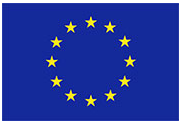
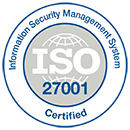
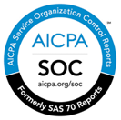
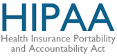
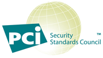

---

 

copyright:

  years: 2015，2016

 

---

{:shortdesc: .shortdesc}
{:new_window: target="_blank"}

# 安全合规性
{: #compliance}

上次更新时间：2015 年 12 月 15 日
{: .last-updated}
 
 <!-- Testing format -->

{{site.data.keyword.Bluemix_notm}} 提供了一个您可以信任的安全云平台。Bluemix 平台和服务基于业界最佳标准（包括 ISO 27001、ISO 27002 和 SOC 2）构建。
{:shortdesc}

 **欧盟 (EU) 示范条款**是一种协议，用于保护从欧盟 (EU) 或欧洲经济区 (EEA) 传输到第三方国家或地区的个人数据。“欧盟 (EU) 示范条款”是由位于 EU 或 EEA 的客户（数据导出方）与位于第三方国家或地区的 IBM 数据处理方（数据导入方）之间签订的。IBM SaaS 欧盟 (EU) 示范条款包含数据导出方和数据导入方的权利和责任，以及数据主体的权利。“IBM SaaS 欧盟示范条款”可确保个人数据在第三方国家或地区处理时仍能受到像在 EU 或 EEA 中一样的保护。

 对于日本的银行和相关金融机构，计算机系统必须具有适当的安全程序，这些程序应基于金融行业信息系统中心 (FISC) 安全准则。**FISC** 安全准则由日本金融厅 (FSA)、日本央行 (BOJ) 和 FISC 贯彻实施。
 
 Bluemix 已通过**国际标准化组织 (ISO) 27001 和 27002 标准**的认证，这两个标准定义了信息安全管理过程的最佳做法。ISO 27001 标准根据不同组织的需求规定了应如何建立、实施和记录信息安全管理系统 (ISMS)，以及应如何实施安全性控制。ISO 27002 标准对 ISO 27001 中的每种安全性控制进行了详细的说明。ISO 27000 系列标准中包含了一个确定风险规模和评估资产价值的过程，旨在保护书面、口头和电子信息的机密性、完整性和可用性。 

Bluemix 经第三方安全公司审计，满足 ISO 27001 的所有要求：Bluemix ISO 27001:2015 注册证书。

 **服务组织控制 (SOC)** 报告定义了如何对服务组织评估与安全性、可用性、处理完整性、机密性和隐私性相关的主要内部控制做法。这些报告是使用美国注册会计师协会 (AICPA) 指南生成的，包含以下各项： 

  * 组织监督
  * 供应商管理程序
  * 内部公司治理和风险管理流程
  * 法规监督
 

有关 Bluemix 安全性和合规性的更多信息，请参阅 [IBM SaaS security](http://www.ibm.com/cloud-computing/built-on-cloud/saas-security){:new_window}。

 
 <!-- testing format ends -->

<!-- DRAFT VERSIONS -->

# 草稿版本

**欧盟 (EU) 示范条款**

欧盟 (EU) 示范条款是一种协议，用于保护从欧盟 (EU) 或欧洲经济区 (EEA) 传输到第三方国家或地区的个人数据。“欧盟 (EU) 示范条款”是由位于 EU 或 EEA 的客户（数据导出方）与位于第三方国家或地区的 IBM 数据处理方（数据导入方）之间签订的。IBM SaaS 欧盟 (EU) 示范条款包含数据导出方和数据导入方的权利和责任，以及数据主体的权利。“IBM SaaS 欧盟示范条款”可确保个人数据在第三方国家或地区处理时仍能受到像在 EU 或 EEA 中一样的保护。

**FISC**

对于日本的银行和相关金融机构，计算机系统必须具有适当的安全程序，这些程序应基于金融行业信息系统中心 (FISC) 安全准则。FISC 安全准则由日本金融厅 (FSA)、日本央行 (BOJ) 和 FISC 贯彻实施。

**HIPAA**

美国国会在 1996 年颁布的健康保险携带和责任法案 (HIPAA) 旨在保障失业后的员工仍能享受健康保险。HIPAA 由美国民权办公室以及卫生和公众服务部负责监管和实施。HIPAA 除了包含 1996 年法案中的规范外，还包含 2009 年颁布的医疗信息技术促进经济和临床健康法案 (HITECH) 中的隐私要求。

有关使您的 Bluemix 环境达到 HIPAA 合规性、通过 HIPAA 合规性认证以及保持 HIPAA 合规性的更多信息或帮助，请联系 {{site.data.keyword.Bluemix_notm}} [销售](mailto:cloudplatform_compliance@us.ibm.com){:new_window}团队。

**IDA MTCS**

新加坡通讯及新闻部 (IDA) 颁布的多层云安全性 (MTCS) 标准定义了云计算的安全级别。该标准的目标是促进云计算的采用，并提供了云服务提供商 (CSP) 的责任。 

MTCS 定义了一个多层框架，支持 CSP 应用通用标准来满足针对数据敏感度和业务关键型操作的不同云用户需求。

MTCS 还包含披露和安全报告，可提高与 CSP 的服务和安全做法关联的信息透明度和风险可视性。

有关使您的 Bluemix 环境达到 MTCS 合规性、通过 MTCS 合规性认证以及保持 MTCS 合规性的更多信息或帮助，请联系 {{site.data.keyword.Bluemix_notm}} [销售](mailto:cloudplatform_compliance@us.ibm.com){:new_window}团队。

**ISO 27001 和 ISO 27002**

Bluemix 已通过国际标准化组织 (ISO) 27001 和 27002 标准的认证，这两个标准定义了信息安全管理过程的最佳做法。ISO 27001 标准根据不同组织的需求规定了应如何建立、实施和记录信息安全管理系统 (ISMS)，以及应如何实施安全性控制。ISO 27002 标准对 ISO 27001 中的每种安全性控制进行了详细的说明。ISO 27000 系列标准中包含了一个确定风险规模和评估资产价值的过程，旨在保护书面、口头和电子信息的机密性、完整性和可用性。 

Bluemix 经第三方安全公司审计，满足 ISO 27001 的所有要求：Bluemix ISO 27001:2015 注册证书。

**PCI DSS**

支付卡行业数据安全标准 (PCI DSS) 可帮助处理卡支付的组织通过提高对数据及数据泄露的控制，防止信用卡欺诈。

PCI DSS 适用于业务实体提供的所有服务，但以下实体除外：
  * 直接参与交易数据和/或持卡人信息的处理、存储、传输和切换的支付卡品牌成员或商家
  * 向商家、服务提供者或可能影响持卡人数据安全性的成员提供服务的公司
  
有关使您的 Bluemix 环境达到 PCI 合规性、通过 PCI 合规性认证以及保持 PCI 合规性的更多信息或帮助，请联系 {{site.data.keyword.Bluemix_notm}} [销售](mailto:cloudplatform_compliance@us.ibm.com){:new_window}团队。

**SOC 1、2 和 3**

服务组织控制 (SOC) 报告定义了如何对服务组织评估与安全性、可用性、处理完整性、机密性和隐私性相关的主要内部控制做法。这些报告是使用美国注册会计师协会 (AICPA) 指南生成的，包含以下各项： 

  * 组织监督
  * 供应商管理程序
  * 内部公司治理和风险管理流程
  * 法规监督

有关 Bluemix 安全性和合规性的更多信息，请参阅 [IBM SaaS security](http://www.ibm.com/cloud-computing/built-on-cloud/saas-security){:new_window}。

