---

copyright:
  years: 2016
lastupdated: "2016-10-13"

---

{:new_window: target="_blank"}
{:shortdesc: .shortdesc}
{:screen: .screen}
{:codeblock: .codeblock}
{:pre: .pre}

# Getting started with Mobile Messaging Connect service
{: #gettingstartedMMC}


Mobile Messaging Connect service is a cloud integration service that provides common connectors with leading social messaging tools (e.g. WeChat, etc.) and a messaging based application development framework, and accelerates mobile messaging based app development on Bluemix with toolkits and analytics.
{:shortdesc}

Let's get started to create your message application.

## Step 1: Create Mobile Messaging Connect Account
{: #createAccount}

### Create Account

Account is a container for managing multiple message channels and application could consume its API to proivde different capabilities.

1. After create Mobile Messaging Connect, get into service console: 

	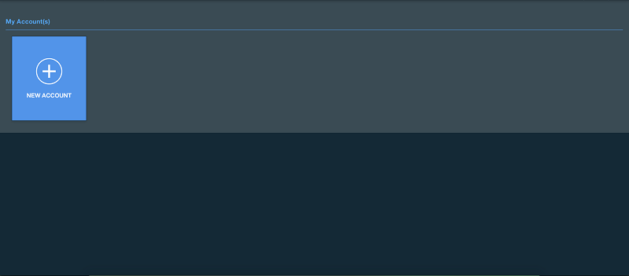

2. Click "Create Account" button and fill in the form. An application endpoint is used to receive message. You could setup later in next section. And then click "Complete".

	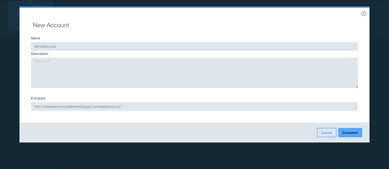

3. After that, the created account will display in view and you could enter the dashboard by click it. 

	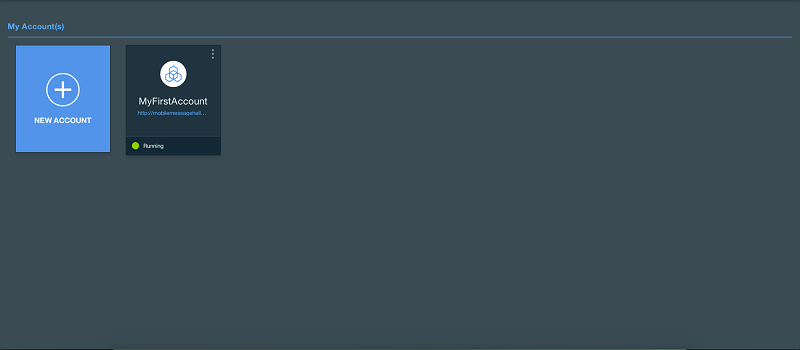

4. The dashboard shown as following:

	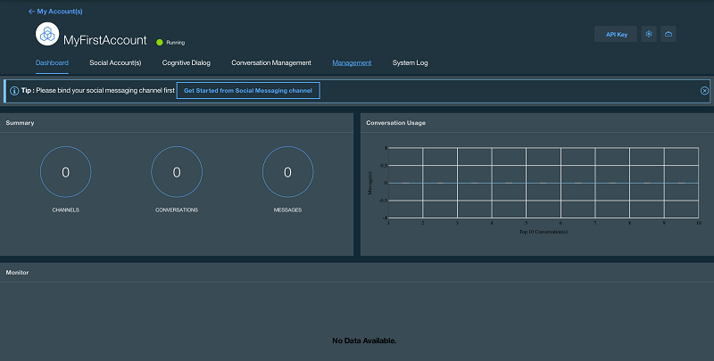


## Step 2: Create Messaging Channel (Example : Using Wechat Development Account)
{: #createChannel}

### Create Channel

In this section, as an example, let's create your first Wechat channel.

1. Click Get Started to create your first social message channel, e.g. Wechat.

	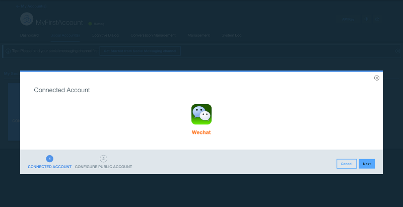

2. Apply your wechat development account at [here](http://mp.weixin.qq.com/debug/cgi-bin/sandbox?t=sandbox/login){: new_window}.

	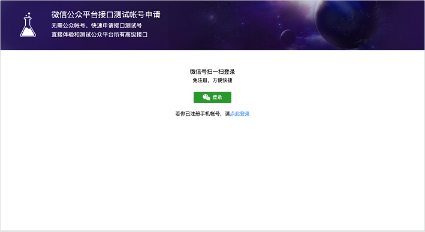

3. Fill in the form with the APP ID/APP Secret in your wechat development account.

	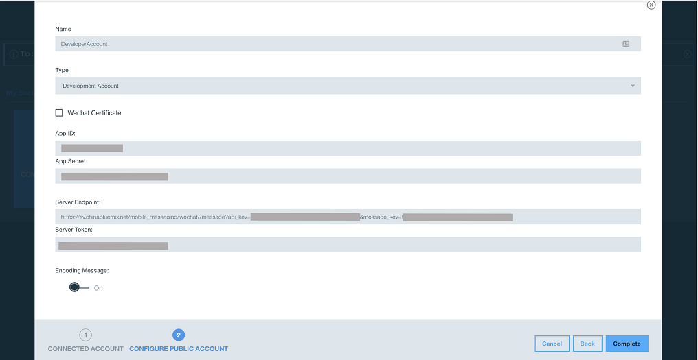

4. At your wechat development account configuration, using the Server Endpoint fill into URL and Server Token fill into Token. Click "Submit".

	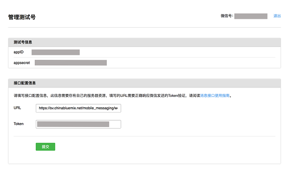

5. Click "Complete" to save your channel.

	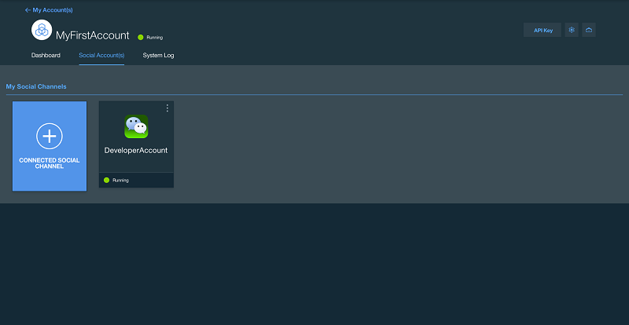


## Step 3: Create Application Endpoint to Receive/Reply Messages
{: #createApplicationEndpoint}

### Create Application Endpoint

1. Create Application Endpoint.

	A endpoint is API which used to receive message/events from Mobile Messaging Service. You could implement it in any langugage. If you didn't point one, a default application endpoint will be used, which will always response a "SUCCESS" message.

	Tips: The endpoint can be accessed from internet.

	A nodeJS example is available [here](https://hub.jazz.net/project/chevalier87/MobileMessageHelloworld){: new_window}.

	> POST http://yourapp:port/endpoint

	An example message request will include following json:

	```
        {
            "message" : {
                "message_key" : "fe043d36-eef1-4806-ae1d-fc0a977afea",
                "message_source" : "wechat",
                "sender" : "some_user",
                "receiver" : "me",
                "thread_id" : "thread_random_001",
                "message_type" : "text",
                "text" : "hi",
                "create_time" : 1470240553520
            }
        }
	```
	{: codeblock}

	An example message response should include following json:

	```
        {
            "message_key" : "fe043d36-eef1-4806-ae1d-fc0a977afea",
            "sender" : "some_user",
            "receiver" : "me",
            "thread_id" : "thread_random_001",
            "response_time" : 1470240553620,
            "responseMessages": [{
                "type" : "text",
                "value" : "hi, there!"
            }]
        }
	```
	{: codeblock}

2. Register Application Endpoint

	Click "Edit Account".

	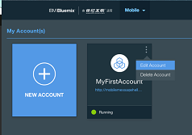

	You could now change the application endpoint URL to your application. e.g. http://mobilemessagehelloworld.mybluemix.net/message. Click "Complete" to save the result.

	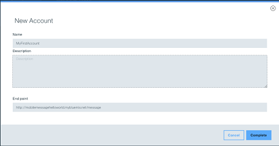


## Step 4: Test Your First Message Application
{: #testResult}

### Test Result

Now, you already setup a message application. Let's have a test.

1. Say "Hi" to your application.

	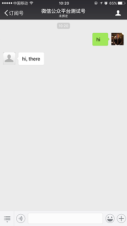

2. In dashboard, you could monitor the messages.

	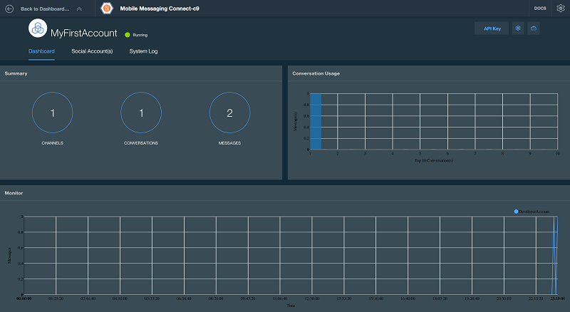


# API Documentation
{: #restAPI}

## Message

### GET /api/v2/{api_key}/message/received
{: #getReceivedMessage}

Get received message.

* Request

    * **URI Parameters**

        --api_key: required (string)
    
* Response

    * **HTTP status code 200**
    * **Body**
  
        **Type: application/json**
	
	    **Example:**
        ```
        {
            "status": 0,
            "result": [
                {
                    "message_id": 0,
                    "message_type": "string",
                    "sender": "string",
                    "receiver": "string",
                    "message_key": "string",
                    "text": "string"
                }
            ]
        }
        ```
	    {: screen}


### POST /api/v2/{api_key}/message/send 
{: #sendMessage}

Send message.

* Request

    * **URI Parameters**

        --api_key: required (string)
   	
    * **Body**
  
        **Type: application/json**
	
	    **Example:**
	    ```
        {
            "message_id": 0,
            "message_type": "string",
            "sender": "string",
            "receiver": "string",
            "message_key": "string",
            "text": "string"
        }
	    ```
	    {: screen}

* Response

    * **HTTP status code 200**
    * **Body**
  
        **Type: application/json**
	
	    **Example:**
        ```
        {
            "status": 0,
            "result": "string"
        }
	    ```
	    {: screen}
