---

copyright:
  years: 2016
lastupdated: "2016-10-13"

---

{:new_window: target="_blank"}
{:shortdesc: .shortdesc}
{:screen: .screen}
{:codeblock: .codeblock}
{:pre: .pre}

# 欢迎使用移动消息互联服务
{: #gettingstartedMMC}


利用我们为你提供的用来对接主流社交通讯工具（例如微信）的消息连接器和基于消息交互服务的应用开发工具框架，你可以进行快速、便捷、定制化的交互式移动应用的开发，从而实现为用户服务的业务价值。
{:shortdesc}

一起来创建你的消息服务应用吧！

## 步骤 1: 创建消息账户
{: #createAccount}

### 创建账户

用户可以在每一个消息账户中管理多个移动消息账号，这些移动消息的账号会共享相同的消息处理的API和应用，用户只需要创建一个应用，即可以在不同的社交平台上达到类似的用户体验。

1. 在创建服务的实例后，可以通过点击服务进入到服务的管理界面： 

	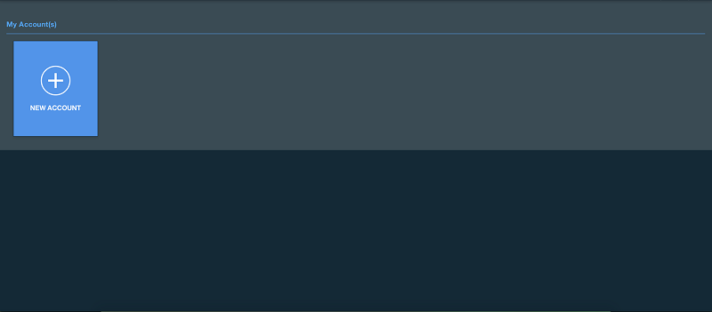

2. 可以通过点击创建账户创建一个消息账户。 请在消息接入点输入框中填入消息处理应用在互联网上可以被访问到的接口的地址信息，您也可以选在在下一步创建好应用后，再通过编辑功能修改消息接入点的信息。

	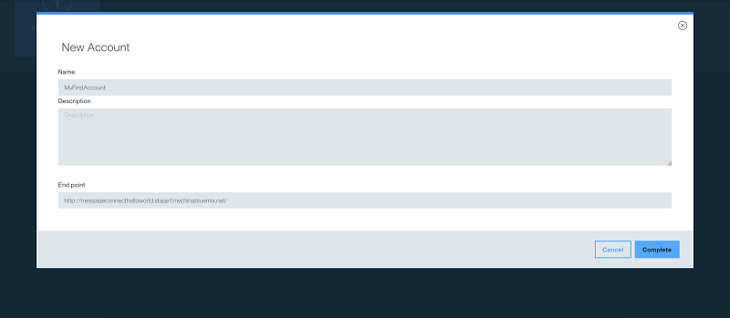

3. 现在你创建的消息账号已经显示在页面上，您可以通过点击它进入到账号的仪表盘页面。

	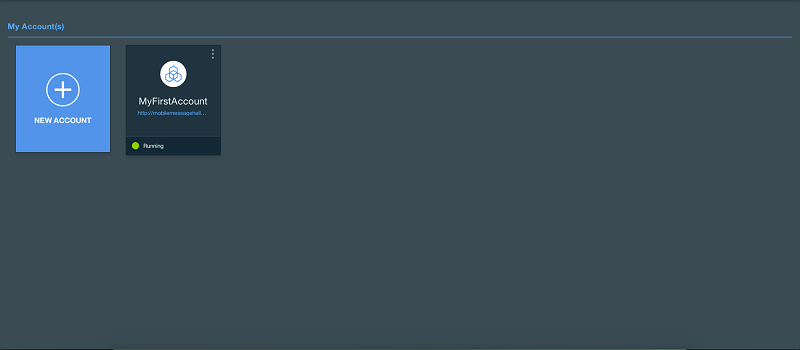

4. 消息账户的仪表盘信息显示如下，由于还没有任何消息，仪表盘的信息暂时为空。

	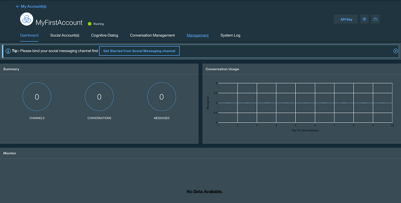


## 步骤 2: 关联第一个移动消息账号（以微信为例）
{: #createChannel}

### 创建移动消息账户

在这一小节，我们来关联一个微信的测试账号（平台暂时只支持微信的文本消息接入，更多功能敬请期待）。

1. 可以通过点击提示里的按钮开始关联移动消息账号，在这里，我们先来关联一个微信的测试账号。 

	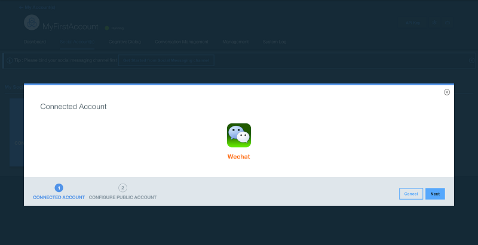

2. 首先，您可以通过点击这个链接申请您的微信测试账号。[点击申请](http://mp.weixin.qq.com/debug/cgi-bin/sandbox?t=sandbox/login){: new_window}.

	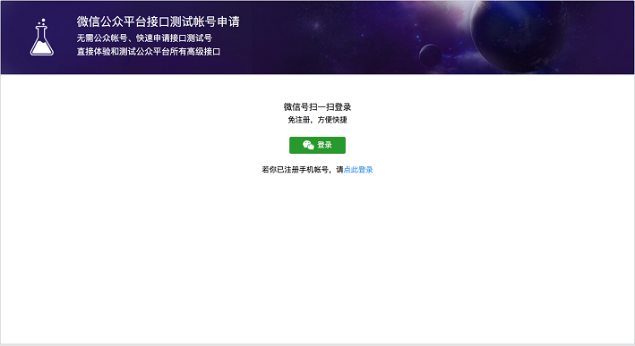

3. 通过微信扫码申请后，在微信测试账号的管理界面，您可以看到您的APP ID和APP Secret，复制这两个值到服务的表单中。如果是在正式的微信公共账号中，这两个值会出现在开发者中心的页面，您可能需要您的微信公共账号管理员的批准，才可以访问这些信息。

	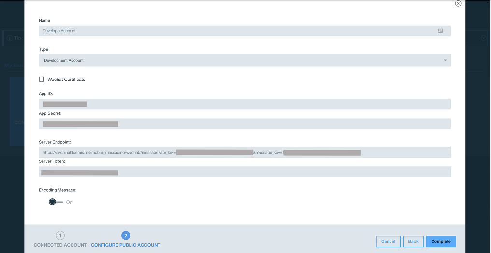

4. 在我们的表单中，自动生成了消息处理的URL和token，请您将这两个值，填写到微信公共账号的服务器配置中，点击提交，微信会通过API进行校验，成功的话，您可以看到绿色的信息条。

	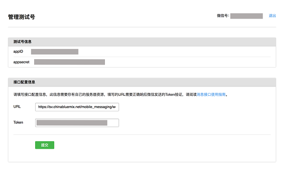

5. 微信验证成功后，请您在我们的表单中点击完成。

	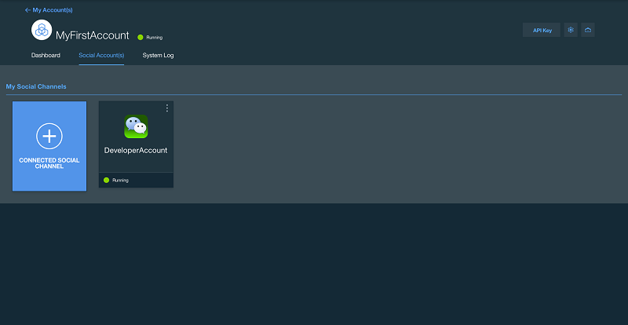


## 步骤 3: 创建消息处理应用
{: #createApplicationEndpoint}

### 创建消息处理接口

1. 创建应用和消息接入点。

	您需要创建一个应用并且实现一个消息接入点的接口，这个接口将用来接收来自于移动消息的信息。如果您不配置消息接入点，系统将默认将消息转发到默认应用，无论输入什么，默认应用会返回SUCCESS，表示连接成功。

	提示：消息接入点必须可以从互联网访问，建议使用IBM Bluemix作为应用容器，以达到更好的性能。

	这里我们提供了一个NodeJS的样例应用供您参考。[点击这里](https://hub.jazz.net/project/chevalier87/MobileMessageHelloworld){: new_window}.

	> POST http://yourapp:port/endpoint

	消息接入点的请求体包含如下的JSON信息：

	```
        {
            "message" : {
                "message_key" : "fe043d36-eef1-4806-ae1d-fc0a977afea",
                "message_source" : "wechat",
                "sender" : "some_user",
                "receiver" : "me",
                "thread_id" : "thread_random_001",
                "message_type" : "text",
                "text" : "hi",
                "create_time" : 1470240553520
            }
        }
	```
	{: codeblock}

	您需要处理用户的消息，然后在响应的内容中包含如下的JSON信息：

	```
        {
            "message_key" : "fe043d36-eef1-4806-ae1d-fc0a977afea",
            "sender" : "some_user",
            "receiver" : "me",
            "thread_id" : "thread_random_001",
            "response_time" : 1470240553620,
            "responseMessages": [{
                "type" : "text",
                "value" : "hi, there!"
            }]
        }
	```
	{: codeblock}

2. 编辑或者重新注册消息接入点

	在账户管理的页面，您可以点击每个消息账户右上角的菜单图标，以编辑账户信息，修改接入点。

	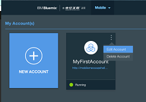

	在打开的编辑界面中，您可以修改消息接入点的信息，例如，http://mobilemessagehelloworld.mybluemix.net/message。点击完成以保存结果。

	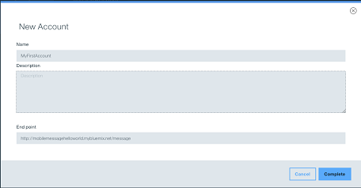


## 步骤 4： 测试您的第一个移动消息应用
{: #testResult}

### 测试结果

现在，您已经配置好了移动消息账户和消息处理的应用，现在的应用还非常简单，只能简单的返回Hi。 您可以修改程序的逻辑以实现更加复杂的消息处理。

1. 现在，您可以扫码关注您的微信测试账号，关注后，您可以尝试发送消息hi, 按照正常的逻辑，您的应用会自动回复hi, there. 恭喜您，您的第一个移动消息应用已经创建成功了。

	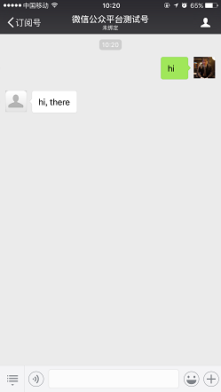

2. 这时，您可以回到仪表盘，观察消息的处理情况。

	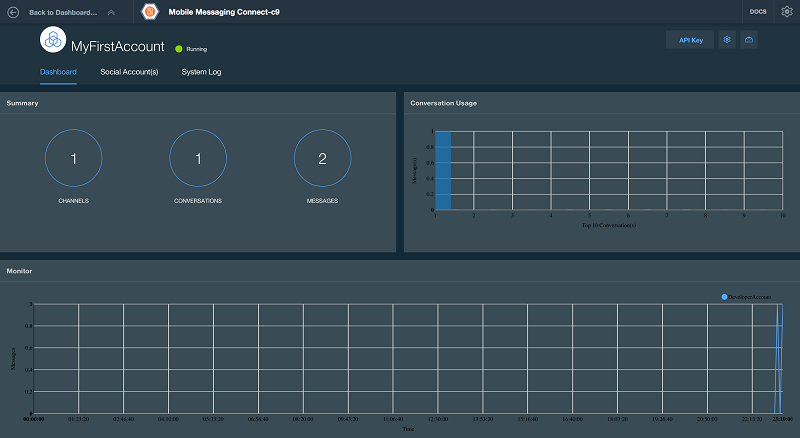


# API文档
{: #restAPI}

## 消息

### GET /api/v2/{api_key}/message/received
{: #getReceivedMessage}

获取接收到的消息。

* Request

    * **URI Parameters**

        --api_key: required (string)
    
* Response

    * **HTTP status code 200**
    * **Body**
  
        **Type: application/json**
	
	    **Example:**
        ```
        {
            "status": 0,
            "result": [
                {
                    "message_id": 0,
                    "message_type": "string",
                    "sender": "string",
                    "receiver": "string",
                    "message_key": "string",
                    "text": "string"
                }
            ]
        }
        ```
	    {: screen}


### POST /api/v2/{api_key}/message/send 
{: #sendMessage}

发送消息。

* Request

    * **URI Parameters**

        --api_key: required (string)
   	
    * **Body**
  
        **Type: application/json**
	
	    **Example:**
	    ```
        {
            "message_id": 0,
            "message_type": "string",
            "sender": "string",
            "receiver": "string",
            "message_key": "string",
            "text": "string"
        }
	    ```
	    {: screen}

* Response

    * **HTTP status code 200**
    * **Body**
  
        **Type: application/json**
	
	    **Example:**
        ```
        {
            "status": 0,
            "result": "string"
        }
	    ```
	    {: screen}
